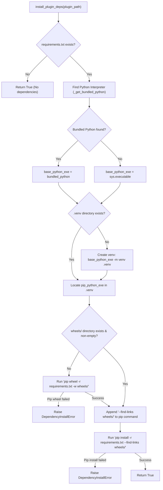

# Installer

The `plugin_host.installer` module provides automated dependency isolation and offline wheel caching for plugins. It inspects plugin manifests and `requirements.txt` files, creates dedicated virtual environments (`.venv`), automatically pre-builds wheels for offline resilience, and installs packages without polluting the host environment.

```python
from plugin_host.installer import (
    install_plugin_deps,
    DependencyInstallError,
    _get_bundled_python,
)
```

---

## Dependency Resolution Flow

The following diagram illustrates how Evoker resolves, caches, and installs plugin dependencies:



---

## Classes

### `DependencyInstallError`

```python
class DependencyInstallError(Exception):
    """Raised when plugin dependencies fail to install."""
    pass
```

Raised when any subprocess command in the dependency installation pipeline (`pip wheel` or `pip install`) returns a non-zero exit code.

---

## Functions

### `install_plugin_deps()`

```python
def install_plugin_deps(plugin_path: Path) -> bool
```

Main entry point for plugin dependency resolution and environment setup.

#### Parameters

| Parameter | Type | Description |
| :--- | :--- | :--- |
| `plugin_path` | `Path` | Directory path of the target plugin. |

#### Step-by-Step Resolution Process

1. **Check Requirements**: Inspects `plugin_path / "requirements.txt"`. If the file does not exist, returns `True` immediately.
2. **Resolve Base Interpreter**: Invokes `_get_bundled_python()`. If a standalone bundled interpreter exists in `plugin_host/pythons/`, it is selected as `base_python_exe`. Otherwise, falls back to the host interpreter (`sys.executable`).
3. **Initialize Virtual Environment**: If `plugin_path / ".venv"` does not exist, runs `[base_python_exe, "-m", "venv", str(venv_dir)]`.
4. **Locate Virtualenv Interpreter**:
   - **Windows**: `plugin_path / ".venv" / "Scripts" / "python.exe"`
   - **POSIX**: `plugin_path / ".venv" / "bin" / "python"`
5. **Build Offline Wheel Cache**: If `plugin_path / "wheels"` is missing or empty:
   - Creates the `wheels/` folder.
   - Executes `pip wheel -r requirements.txt -w wheels/` using the virtual environment's Python.
   - Raises `DependencyInstallError` if wheel building fails.
6. **Install Dependencies**: Executes `pip install -r requirements.txt --find-links wheels/`.
   - The `--find-links` flag ensures that pip prioritizes cached local wheel archives for offline stability.
   - Raises `DependencyInstallError` if installation fails.

#### Returns

- `bool`: `True` if installation succeeded or no requirements were defined.

#### Raises

- `DependencyInstallError`: If `pip wheel` or `pip install` subprocess execution fails.

---

### `_get_bundled_python()`

```python
def _get_bundled_python() -> Path | None
```

Scans the internal `plugin_host/pythons/` distribution directory for a standalone Python interpreter.

#### Search Logic

- Checks `plugin_host/pythons/`.
- Walks the directory tree looking for:
  - Windows: `python.exe`
  - POSIX: `python3` located within a `bin/` directory component.
- Returns the absolute `Path` to the executable if discovered, or `None` if no bundled Python distribution exists.

---

## Usage Example

```python
from pathlib import Path
from plugin_host.installer import install_plugin_deps, DependencyInstallError

plugin_dir = Path("./plugins/data_analysis")

try:
    success = install_plugin_deps(plugin_dir)
    if success:
        print(f"Dependencies installed successfully for {plugin_dir.name}")
except DependencyInstallError as exc:
    print(f"Failed to install dependencies for {plugin_dir.name}: {exc}")
```
