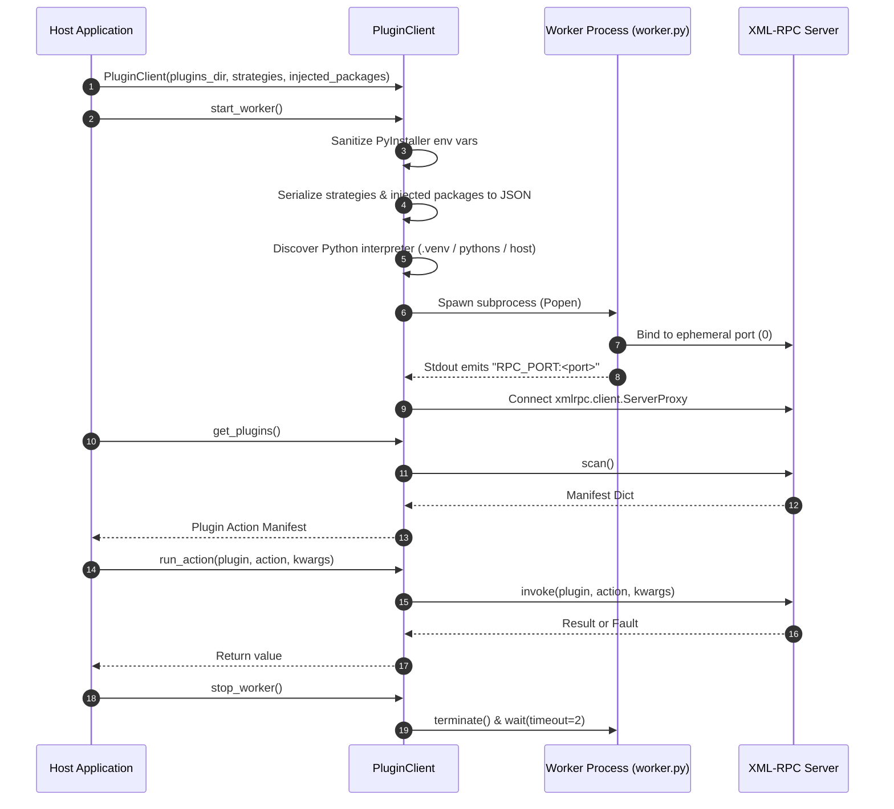

# PluginClient

`PluginClient` is the primary host-side interface in Evoker for managing and interacting with out-of-process plugin workers. It handles subprocess lifecycle management, environment variable sanitization, interpreter discovery, and XML-RPC communication over local TCP sockets.

```python
from evoker_client.client import PluginClient
```

---

## Architecture Overview

`PluginClient` orchestrates communication between the host application and isolated worker processes.



---

## Constructor

```python
PluginClient(
    plugins_dir: Path,
    strategies: Optional[List[Dict[str, Any]]] = None,
    injected_packages: Optional[List[Path]] = None
)
```

Initializes a new `PluginClient` instance with plugin discovery paths, custom action discovery strategies, and package injection paths.

### Parameters

| Parameter | Type | Default | Description |
| :--- | :--- | :--- | :--- |
| `plugins_dir` | `Path` | *Required* | Absolute path to the directory containing plugin subdirectories. |
| `strategies` | `Optional[List[Dict[str, Any]]]` | `None` | List of strategy definitions serialized as dictionaries. Used by the worker to classify and validate plugin functions. |
| `injected_packages` | `Optional[List[Path]]` | `None` | List of directory paths to inject into the worker subprocess's `sys.path`. |

### Strategy Configuration Format

Each dictionary in the `strategies` list specifies a match rule:

- **Prefix Strategy**:
  ```python
  {"type": "prefix", "value": "menu_"}
  ```
- **Exact Match Strategy**:
  ```python
  {
      "type": "exact",
      "value": "on_start",
      "args": ["app_context"]
  }
  ```

---

## Methods

### `start_worker()`

```python
def start_worker(self) -> None
```

Spawns the worker subprocess, configures process isolation, captures the allocated RPC port, and establishes the XML-RPC proxy connection.

#### Lifecycle Execution Steps

1. **Environment Sanitization**: Strips PyInstaller-specific environment variables (`PYTHONPATH`, `PYTHONHOME`, `PATH`) or restores original variables (`ORIG_PYTHONPATH`, `ORIG_PATH`) to prevent bundled libraries from contaminating the worker interpreter.
2. **Configuration Serialization**: Encodes `strategies` into `EVOKER_STRATEGIES` and `injected_packages` into `EVOKER_INJECTED_PACKAGES` as JSON strings within the subprocess environment.
3. **Interpreter Discovery**: Resolves the Python executable in order of priority:
   - Plugin-specific virtual environment (`.venv/Scripts/python.exe` or `.venv/bin/python`)
   - Standalone bundled Python (`pythons/python-*/python/python.exe`)
   - Host executable (`sys.executable`)
4. **Process Launch**: Spawns `evoker.worker` with unbuffered I/O (`-u`) via `subprocess.Popen`.
5. **Port Scraping**: Reads stdout line-by-line within a 5-second timeout window until it captures the `RPC_PORT:<port>` initialization token.
6. **Stdout Forwarding**: Spawns a background daemon thread to stream subsequent worker stdout to the host application's `sys.stdout`.
7. **Proxy Initialization**: Instantiates an `xmlrpc.client.ServerProxy` targeting `http://localhost:<port>`.

#### Raises

- `RuntimeError`: If the worker fails to spawn or does not emit the `RPC_PORT:<port>` token within 5 seconds.

---

### `stop_worker()`

```python
def stop_worker(self) -> None
```

Terminates the running worker subprocess cleanly.

#### Behavior

- Sends a `SIGTERM` (or calls `terminate()` on Windows) to the child process.
- Waits up to 2.0 seconds for graceful exit.
- Sets `worker_process` to `None`.

---

### `get_plugins()`

```python
def get_plugins(self) -> dict
```

Requests the worker to discover and load all available plugins from `plugins_dir`, returning an introspection manifest over XML-RPC.

#### Returns

A nested dictionary containing plugin and action metadata:

```python
{
    "plugin_name": {
        "action_name": {
            "name": "action_name",
            "signature": {
                "parameters": {
                    "param_name": {
                        "type": "str",
                        "required": True
                    }
                }
            },
            "is_keyword": False,
            "strategy_metadata": {
                "menu_name": "Export PDF"
            }
        }
    }
}
```

---

### `run_action()`

```python
def run_action(self, plugin_name: str, action_name: str, kwargs: dict) -> Any
```

Invokes an action exported by a specific plugin within the worker process.

#### Parameters

| Parameter | Type | Description |
| :--- | :--- | :--- |
| `plugin_name` | `str` | Name of the target plugin directory/module. |
| `action_name` | `str` | Name of the function to invoke. |
| `kwargs` | `dict` | Keyword arguments to pass to the plugin function. |

#### Returns

- `Any`: The return value of the plugin function (must be XML-RPC marshallable).

#### Exceptions

- `xmlrpc.client.Fault`: Raised when the plugin function raises an unhandled exception inside the worker. The fault code and string describe the remote traceback.
- `ValueError`: Raised when an XML-RPC serialization error occurs, connection fails, or invalid arguments are supplied.

---

## Usage Examples

### Basic Plugin Execution

```python
from pathlib import Path
from evoker_client.client import PluginClient

plugins_path = Path("./plugins").resolve()

client = PluginClient(
    plugins_dir=plugins_path,
    strategies=[
        {"type": "prefix", "value": "action_"},
        {"type": "exact", "value": "initialize", "args": ["config"]}
    ]
)

try:
    # 1. Start the worker process
    client.start_worker()

    # 2. Query available plugins and actions
    plugins = client.get_plugins()
    print("Discovered plugins:", list(plugins.keys()))

    # 3. Execute a plugin action
    result = client.run_action(
        plugin_name="data_processor",
        action_name="action_transform",
        kwargs={"data": [1, 2, 3, 4], "scale": 2.5}
    )
    print("Action result:", result)

finally:
    # 4. Clean up worker process
    client.stop_worker()
```

### Handling Injected Host Packages

```python
from pathlib import Path
from evoker_client.client import PluginClient

client = PluginClient(
    plugins_dir=Path("./plugins"),
    injected_packages=[
        Path("./src/host_api"),
        Path("./src/shared_models")
    ]
)

client.start_worker()
manifest = client.get_plugins()
client.stop_worker()
```
