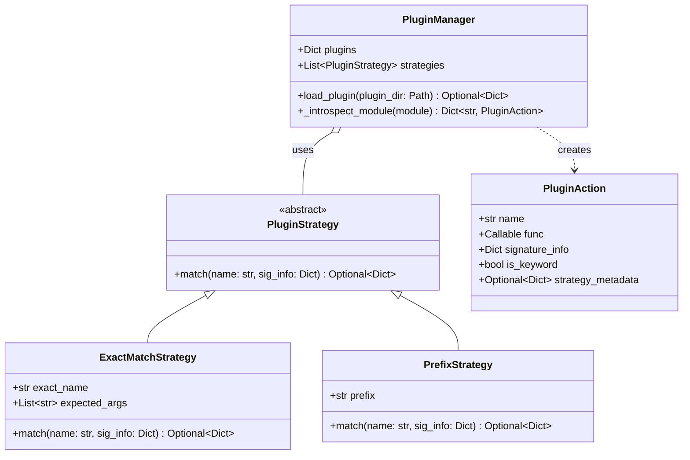
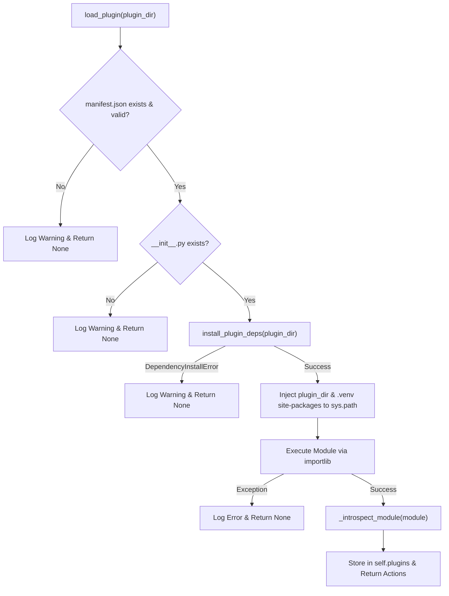

# PluginManager

The `evoker.manager` module provides in-process plugin management, dynamic module loading, signature introspection, and function classification using declarative strategies.

```python
from evoker.manager import (
    PluginManager,
    PluginStrategy,
    ExactMatchStrategy,
    PrefixStrategy,
    PluginAction,
)
```

---

## Class Hierarchy & Architecture

The following diagram illustrates the relationship between strategies, the plugin manager, and the resulting action metadata:



---

## PluginStrategy (ABC)

```python
from abc import ABC, abstractmethod
from typing import Dict, Any, Optional

class PluginStrategy(ABC):
    @abstractmethod
    def match(self, name: str, sig_info: Dict[str, Any]) -> Optional[Dict[str, Any]]:
        """
        Evaluate whether a function matches the strategy.

        Returns:
            - dict: Metadata describing the match (marks action as a keyword action).
            - None: No match (function remains a standard action).
            - Raises ValueError: Invalid match, rejecting/ignoring the action entirely.
        """
        pass
```

`PluginStrategy` is the abstract base class for defining rules that match, classify, and extract metadata from plugin functions during module introspection.

### `match()` Return Contract

| Return Value / Effect | Description | Action State |
| :--- | :--- | :--- |
| `dict` (e.g. `{}`) | Strategy matched successfully. Metadata stored in `strategy_metadata`. | `is_keyword = True` |
| `None` | Strategy does not apply to this function. Evaluation continues to next strategy. | `is_keyword = False` (if no other matches) |
| `raise ValueError` | Function violates strategy requirements (e.g., incorrect argument names). | Action is ignored / skipped entirely. |

---

## Built-in Strategies

### `ExactMatchStrategy`

```python
class ExactMatchStrategy(PluginStrategy):
    def __init__(self, exact_name: str, expected_args: List[str]):
        self.exact_name = exact_name
        self.expected_args = expected_args
```

Matches a function only if its identifier exactly matches `exact_name` **and** its parameter list exactly matches `expected_args` in order and name.

#### Behavior

- **Match**: Returns an empty dictionary `{}` if `name == self.exact_name` and `list(sig_info["parameters"].keys()) == self.expected_args`.
- **Mismatch**: Raises `ValueError("Signature mismatch")` if `name == self.exact_name` but parameter names do not match `self.expected_args`. Logs a warning to indicate the mismatch.
- **No match**: Returns `None` if `name != self.exact_name`.

#### Example

```python
# Matches 'def on_start(app_context):' exactly
lifecycle_strategy = ExactMatchStrategy(
    exact_name="on_start",
    expected_args=["app_context"]
)
```

---

### `PrefixStrategy`

```python
class PrefixStrategy(PluginStrategy):
    def __init__(self, prefix: str):
        self.prefix = prefix
```

Matches functions whose names start with the specified `prefix` string.

#### Behavior

- **Match**: If `name.startswith(self.prefix)`, returns a dictionary with the prefix stripped:
  ```python
  {"menu_name": name[len(self.prefix):]}
  ```
- **No match**: Returns `None` if `name` does not start with `prefix`.

#### Example

```python
# Function 'menu_export_data' matches and produces {"menu_name": "export_data"}
menu_strategy = PrefixStrategy(prefix="menu_")
```

---

## PluginAction (dataclass)

```python
@dataclass
class PluginAction:
    name: str
    func: Callable
    signature_info: Dict[str, Any]
    is_keyword: bool
    strategy_metadata: Optional[Dict[str, Any]] = None
```

Represents an introspected callable exported by a plugin.

### Attributes

| Attribute | Type | Description |
| :--- | :--- | :--- |
| `name` | `str` | Name of the function in the plugin module. |
| `func` | `Callable` | Direct reference to the Python callable. |
| `signature_info` | `Dict[str, Any]` | JSON-serializable dictionary describing parameters, inferred types, and requirement flags. |
| `is_keyword` | `bool` | `True` if matched by any active `PluginStrategy`; `False` otherwise. |
| `strategy_metadata` | `Optional[Dict[str, Any]]` | Metadata returned by the matched strategy (e.g., `{"menu_name": "export"}`). |

#### `signature_info` Format

```json
{
  "parameters": {
    "file_path": {
      "type": "str",
      "required": true
    },
    "max_retries": {
      "type": "int",
      "required": false
    }
  }
}
```

---

## PluginManager

```python
class PluginManager:
    def __init__(self, strategies: Optional[List[PluginStrategy]] = None):
        self.plugins: Dict[str, Dict[str, Any]] = {}
        if strategies is None:
            self.strategies = [ExactMatchStrategy("on_start", ["app_context"])]
        else:
            self.strategies = strategies
```

Manages plugin validation, dependency installation, dynamic module importing, and function reflection.

### Default Configuration

If `strategies` is omitted or `None`, `PluginManager` defaults to:
```python
[ExactMatchStrategy("on_start", ["app_context"])]
```

---

### Methods

#### `load_plugin()`

```python
def load_plugin(self, plugin_dir: Path) -> Optional[Dict[str, PluginAction]]
```

Validates and loads a single plugin directory.

##### Processing Lifecycle



1. **Manifest Validation**: Verifies `plugin_dir / "manifest.json"` exists and parses as a valid JSON object.
2. **Entrypoint Verification**: Verifies `plugin_dir / "__init__.py"` exists.
3. **Dependency Installation**: Executes `install_plugin_deps(plugin_dir)`. If dependency resolution fails (`DependencyInstallError`), skips the plugin gracefully.
4. **Path Injection**: Prepend `plugin_dir` and the plugin's isolated virtual environment site-packages (`.venv/Lib/site-packages` or `.venv/lib/python*/site-packages`) to `sys.path`.
5. **Module Execution**: Uses `importlib.util.spec_from_file_location` and `spec.loader.exec_module` to load the module.
6. **Introspection**: Calls `_introspect_module()` to extract valid actions.
7. **Storage**: Caches the loaded plugin in `self.plugins[plugin_dir.name]` containing `manifest`, `actions`, and `module`.

---

#### `_introspect_module()`

```python
def _introspect_module(self, module) -> Dict[str, PluginAction]
```

Inspects public functions defined in the loaded module using Python's `inspect` module.

##### Introspection Rules

- **Private Filtering**: Skips functions starting with an underscore (`_`).
- **Parameter Analysis**: Excludes `self` parameter. Analyzes each parameter's annotation (defaults to `"str"` if untyped) and determines whether it is required (`param.default == inspect.Parameter.empty`).
- **Strategy Evaluation**: Evaluates configured `PluginStrategy` instances against each function:
  - If a strategy matches, marks `is_keyword = True` and sets `strategy_metadata`.
  - If a strategy raises `ValueError`, the action is discarded entirely.
- Returns a mapping of `{action_name: PluginAction}`.

---

## Custom Strategy Example

```python
from typing import Dict, Any, Optional
from evoker.manager import PluginStrategy, PluginManager
from pathlib import Path

class HookStrategy(PluginStrategy):
    """Matches functions starting with 'hook_' that accept an 'event' argument."""
    def match(self, name: str, sig_info: Dict[str, Any]) -> Optional[Dict[str, Any]]:
        if name.startswith("hook_"):
            params = sig_info.get("parameters", {})
            if "event" not in params:
                raise ValueError(f"Hook function '{name}' must accept an 'event' parameter")
            return {"event_type": name[len("hook_"):]}
        return None

# Usage with PluginManager
manager = PluginManager(strategies=[
    HookStrategy(),
    PrefixStrategy("command_")
])

actions = manager.load_plugin(Path("./plugins/analytics_plugin"))
```
