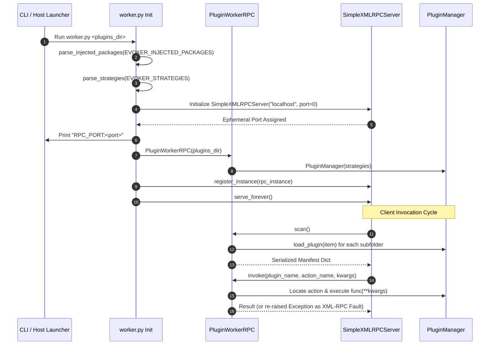

# Worker

The `plugin_host.worker` module implements the isolated worker process execution environment. It boots an embedded XML-RPC server, manages plugin lifecycle within the isolated process, handles package path injections, and exposes remote procedure call (RPC) endpoints for plugin discovery and invocation.

```python
from plugin_host.worker import (
    PluginWorkerRPC,
    start_worker,
    parse_injected_packages,
    parse_strategies,
)
```

---

## Worker Process Flow

The following diagram illustrates how the worker process boots, registers injected modules, and handles client RPC requests:



---

## Module-Level Functions

### `parse_injected_packages()`

```python
def parse_injected_packages(env_val: str) -> None
```

Parses a JSON-encoded array of filesystem paths from the `EVOKER_INJECTED_PACKAGES` environment variable and injects them into the worker's `sys.path`.

#### Injection Rules

- Iterates paths in **reverse order** and uses `sys.path.insert(0, path)`. This ensures the first entry in the input JSON list ends up at index `0` of `sys.path` (highest import resolution priority).
- Ignores entries that are already present in `sys.path` to prevent duplication.
- Catches and logs parsing exceptions without crashing the worker startup.

#### Auto-execution on Import

`plugin_host.worker` automatically checks and parses `EVOKER_INJECTED_PACKAGES` during module load:

```python
if "EVOKER_INJECTED_PACKAGES" in os.environ:
    parse_injected_packages(os.environ["EVOKER_INJECTED_PACKAGES"])
```

---

### `parse_strategies()`

```python
def parse_strategies(env_val: str) -> Optional[List[PluginStrategy]]
```

Parses a JSON-encoded array of strategy configurations from the `EVOKER_STRATEGIES` environment variable and instantiates corresponding `PluginStrategy` objects.

#### Supported Types

| Strategy `type` | Expected Keys | Instantiated Class |
| :--- | :--- | :--- |
| `"prefix"` | `{"type": "prefix", "value": "<str>"}` | `PrefixStrategy(value)` |
| `"exact"` | `{"type": "exact", "value": "<str>", "args": ["<str>", ...]}` | `ExactMatchStrategy(value, args)` |

#### Returns

- `List[PluginStrategy]`: List of instantiated strategy objects.
- `None`: If parsing fails, JSON is invalid, or the variable is unset.

---

### `start_worker()`

```python
def start_worker(plugins_dir: str, port: int = 0) -> None
```

Initializes and starts the blocking XML-RPC server for plugin operations.

#### Parameters

| Parameter | Type | Default | Description |
| :--- | :--- | :--- | :--- |
| `plugins_dir` | `str` | *Required* | Path to the directory containing plugin packages. |
| `port` | `int` | `0` | TCP port to bind to. `0` binds to an arbitrary available ephemeral port. |

#### Lifecycle Steps

1. Instantiates `SimpleXMLRPCServer(("localhost", port), allow_none=True)`.
2. Inspects `server.server_address[1]` to obtain the actual bound TCP port.
3. Prints `RPC_PORT:<port>` to stdout with immediate flush (`flush=True`), allowing parent processes to scrape the address.
4. Instantiates `PluginWorkerRPC(Path(plugins_dir))` and registers it via `server.register_instance()`.
5. Enters the blocking event loop: `server.serve_forever()`.

---

## PluginWorkerRPC

```python
class PluginWorkerRPC:
    def __init__(self, plugins_dir: Path)
```

The RPC handler class registered with the `SimpleXMLRPCServer`. All public methods on this class are directly callable by the XML-RPC client.

### State & Initialization

- Inspects `os.environ["EVOKER_STRATEGIES"]` to initialize custom strategies.
- Instantiates an internal `PluginManager(strategies=strategies)`.
- Sets `plugins_dir` and initializes `actions_manifest = {}`.

---

### Methods

#### `scan()`

```python
def scan(self) -> dict
```

Scans `plugins_dir`, loads each discovered plugin subdirectory using `PluginManager.load_plugin()`, and returns a serialized manifest dictionary.

##### Return Format

```python
{
    "my_plugin": {
        "export_data": {
            "name": "export_data",
            "signature": {
                "parameters": {
                    "output_path": {
                        "type": "str",
                        "required": True
                    },
                    "format": {
                        "type": "str",
                        "required": False
                    }
                }
            },
            "is_keyword": False,
            "strategy_metadata": None
        }
    }
}
```

---

#### `invoke()`

```python
def invoke(self, plugin_name: str, action_name: str, kwargs: dict) -> Any
```

Executes a specific action exported by a loaded plugin with the provided keyword arguments.

##### Parameters

| Parameter | Type | Description |
| :--- | :--- | :--- |
| `plugin_name` | `str` | Name of the loaded plugin. |
| `action_name` | `str` | Name of the action function to execute. |
| `kwargs` | `dict` | Keyword arguments forwarded to the action function. |

##### Execution & Error Propagation

1. Validates that `plugin_name` exists in `self.manager.plugins`. Raises `ValueError` if missing.
2. Validates that `action_name` exists in `plugin["actions"]`. Raises `ValueError` if missing.
3. Calls the target action function: `action.func(**kwargs)`.
4. If the plugin function raises an unhandled exception:
   - Logs the exception via `logger.error(...)`.
   - Re-raises the exception. The underlying `SimpleXMLRPCServer` serializes it as an XML-RPC `Fault`, allowing the host application's client to handle the traceback.

---

## Standalone Execution

The worker can be launched directly from the command line:

```bash
# Launch worker process against a plugins directory
python -m plugin_host.worker /path/to/plugins
```

When invoked via CLI, `worker.py` parses `sys.argv[1]` as the plugin directory and calls `start_worker(sys.argv[1])`.
