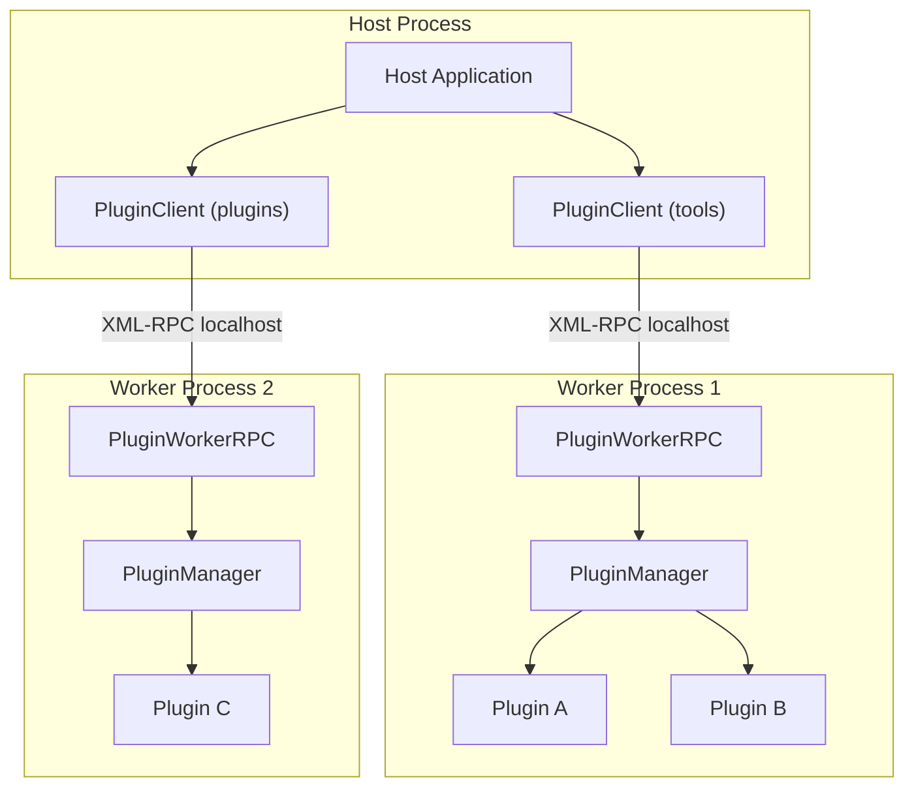
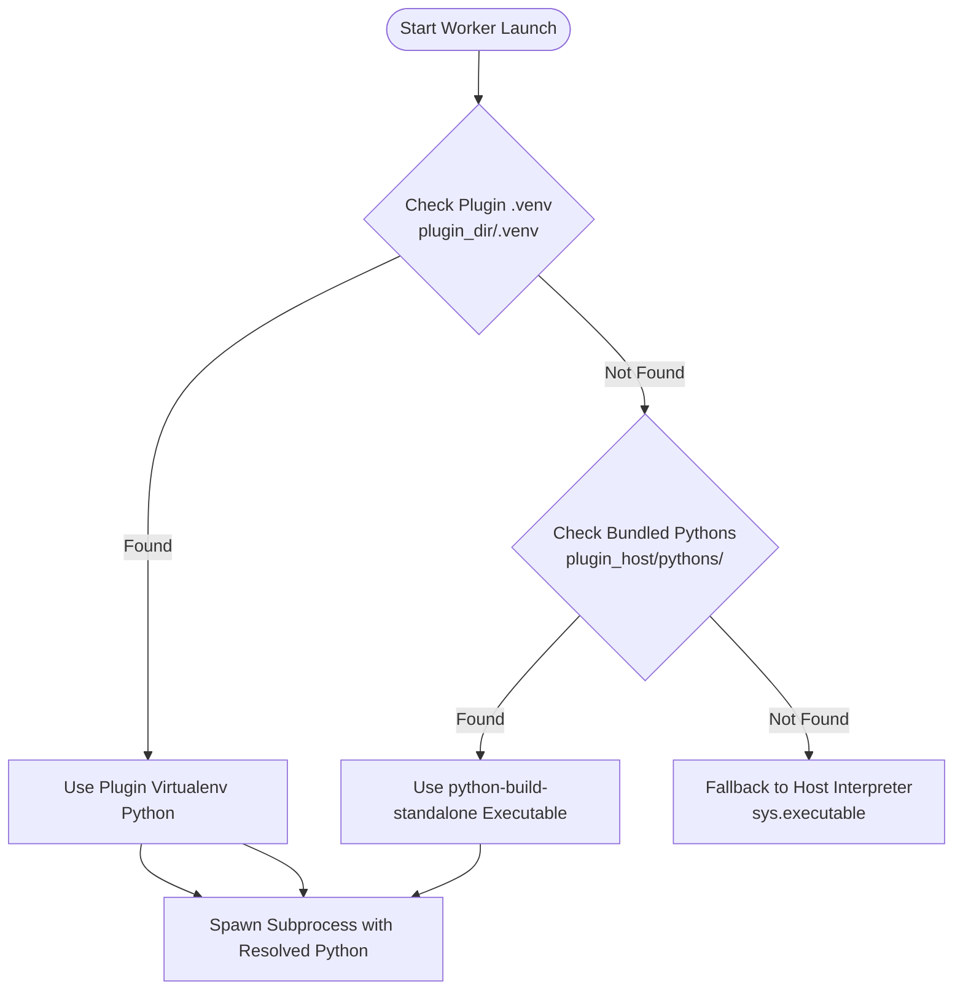
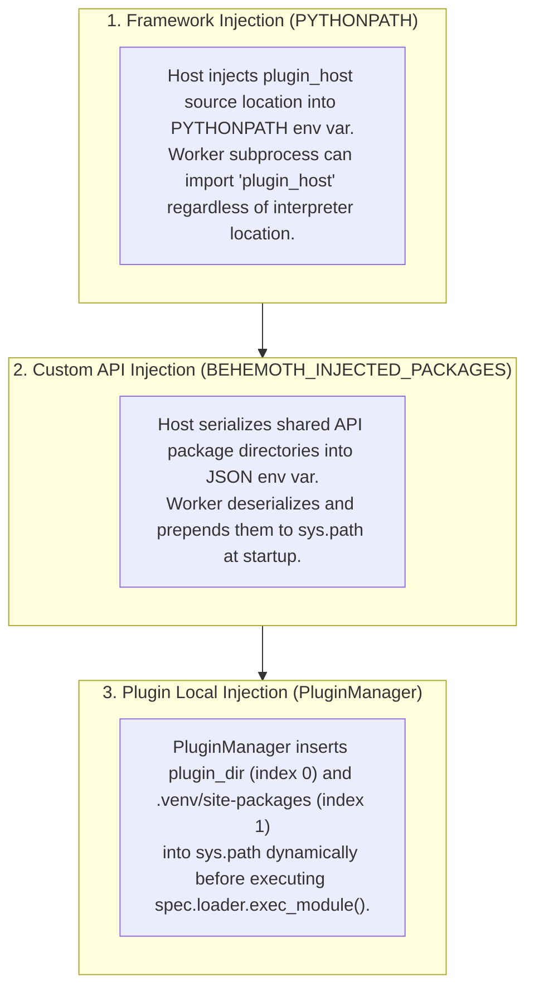

# Architecture Overview

Behemoth is a high-performance, process-isolated plugin framework designed for Python applications that require dynamic extensibility, crash resilience, and cross-interpreter dependency isolation.

This document outlines Behemoth's architectural pillars: the multi-process isolation model, the dual control/data plane communication architecture, multi-tier interpreter discovery, and the multi-layered sys.path injection pipeline.

---

## Process Isolation Model

Modern plugin architectures in Python face severe challenges when loading third-party code directly in the host process:
- **C-Extension Conflicts**: Binary dependencies (e.g., NumPy, PyTorch, Qt) compiled against different ABI versions or runtime libraries can crash the entire host process with segmentation faults.
- **Global Interpreter Lock (GIL) Contention**: CPU-bound plugin tasks block host execution threads.
- **Uncontrolled Global State**: Plugins modifying global state or monkey-patching built-ins can pollute the host application.
- **Fatal Crashes**: Unhandled panics or native crashes terminate the host application instantly.

To eliminate these failure modes, Behemoth implements a **multi-process architecture**. The Host application does not execute plugin code directly; instead, it spawns dedicated Worker subprocesses via Python's `subprocess.Popen`.



### Key Properties of the Worker Model

1. **Dedicated Interpreter Isolation**: Each worker subprocess runs its own Python interpreter instance. It maintains its own `sys.modules`, `sys.path`, memory space, and GIL.
2. **Crash Resilience**: If a plugin raises an unhandled Python exception, the worker catches it and returns an RPC `Fault` back to the host. The worker process remains alive and ready for subsequent invocations. If a plugin triggers a fatal C-level crash, only that specific worker terminates without bringing down the host application.
3. **Multiple Client Domains**: A single host application can spawn multiple `PluginClient` instances targeting different plugin directories (e.g., built-in tools vs. user plugins), isolating their dependencies from one another.
4. **Loopback XML-RPC Transport**: Host and worker communicate over loopback TCP (`localhost`) via standard XML-RPC. Ephemeral OS-assigned ports (port `0`) avoid port conflicts across concurrent workers.

---

## Control Plane vs Data Plane

Behemoth separates inter-process communication into two distinct pathways: a lightweight **Control Plane** and a high-throughput **Data Plane**.

```mermaid
flowchart LR
    subgraph Host["Host Application"]
        H_Ctrl["Host Control Logic"]
        H_Mem["pyarrow.memory_map"]
    end

    subgraph Transport["Communication Channels"]
        XMLRPC["Control Plane: XML-RPC (Localhost TCP)"]
        MMAP["Data Plane: Shared Memory / IPC (.arrow temp file)"]
    end

    subgraph Worker["Plugin Worker Process"]
        W_RPC["PluginWorkerRPC"]
        W_Plug["Plugin Action"]
    end

    H_Ctrl -->|invoke(action, kwargs)| XMLRPC
    XMLRPC -->|Dispatch| W_RPC
    W_RPC --> W_Plug

    W_Plug -.->|Write Table| MMAP
    MMAP -.->|Zero-Copy Read| H_Mem
    W_Plug -->|Return mmap_path string| XMLRPC
    XMLRPC -->|Return file path| H_Ctrl
```

### 1. Control Plane (XML-RPC)

The Control Plane manages orchestration, discovery, and metadata exchange. It uses standard library `xmlrpc.client` and `xmlrpc.server.SimpleXMLRPCServer`.

- **Payload Characteristics**: Strictly lightweight primitives (strings, integers, floats, booleans, lists, and dicts).
- **Core Operations**:
  - `scan()`: Discovers all plugins in the directory, introspects their functions, evaluates strategies, and returns action manifests including parameter signatures.
  - `invoke(plugin_name, action_name, kwargs)`: Executes a target function on a plugin with keyword arguments and returns the result.

```python
# Host Invocation via Control Plane
client = PluginClient(plugins_dir=Path("./plugins"))
client.start_worker()

# 1. Scan for available plugins
manifest = client.get_plugins()

# 2. Invoke a plugin action with primitive arguments
result = client.run_action("hello_world_plugin", "greet", {"name": "Alice"})
```

### 2. Data Plane (PyArrow Memory-Mapped IPC)

Sending large datasets (such as multi-megabyte dataframes, images, tensors, or bulk records) over XML-RPC introduces severe serialization and copying overhead. For heavy payloads, Behemoth utilizes Apache Arrow memory-mapped IPC files:

1. **Sender Writes**: The sender serializes a `pyarrow.Table` or `RecordBatch` to a temporary `.arrow` file using `pa.RecordBatchFileWriter`.
2. **String Handle Crosses Control Plane**: The sender passes only the temporary filesystem path string across XML-RPC.
3. **Receiver Memory-Maps**: The receiver opens the file with `pyarrow.memory_map(path, 'r')` and `pa.RecordBatchFileReader`, gaining instantaneous, zero-copy access to the underlying memory buffers.
4. **Cleanup**: Once reading is complete, the file handle is unmapped and the temporary file is deleted.

```python
import pyarrow as pa
from host_api.arrow_ipc import write_table_to_mmap, read_table_from_mmap, cleanup_mmap

# --- Sending large data from Host to Plugin ---
table = pa.Table.from_arrays(
    [pa.array(["row_1", "row_2", "row_3"]), pa.array([100, 200, 300])],
    names=["id", "value"]
)

# Step 1: Write to memory-mapped IPC file
mmap_path = write_table_to_mmap(table)

# Step 2: Pass file path string via XML-RPC
client.run_action("data_processor", "process_table", {"mmap_path": mmap_path})

# Step 3: Clean up after operation
cleanup_mmap(mmap_path)
```

---

## Multi-Tier Interpreter Discovery

When spawning a worker subprocess, Behemoth determines the appropriate Python interpreter using a 3-tier priority resolution strategy.



### Resolution Order

1. **Plugin Virtual Environment (`<plugin_dir>/.venv`)**:
   - If any plugin in `plugins_dir` contains a `.venv` folder, Behemoth resolves the interpreter to `<plugin_dir>/.venv/Scripts/python.exe` (Windows) or `<plugin_dir>/.venv/bin/python` (POSIX).
   - This ensures plugins with specialized dependencies run inside an isolated virtual environment.

2. **Bundled Standalone Python Distribution**:
   - If `src/plugin_host/pythons/` contains a portable `python-build-standalone` installation (pre-fetched ahead of time via `scripts/download_pythons.py`), Behemoth uses that standalone binary (`python/python.exe` or `python/bin/python3`).
   - This allows packaged desktop distributions (e.g., PyInstaller binaries) to run external Python workers without requiring a system-wide Python installation.

3. **Host Interpreter (`sys.executable`)**:
   - As a final fallback, Behemoth uses the interpreter running the host application (`Path(sys.executable)`).

### Frozen Environments (PyInstaller)

When the host application is packaged with PyInstaller (`getattr(sys, "frozen", False) == True`):
- PyInstaller modifies environment variables such as `PYTHONPATH` and `PYTHONHOME`.
- `PluginClient.start_worker()` sanitizes the child environment by restoring `ORIG_PYTHONPATH` / `ORIG_PYTHONHOME` or removing them to prevent standalone interpreters from loading PyInstaller's embedded libraries.
- If using the frozen executable itself as the worker interpreter, Behemoth passes `--behemoth-worker` so the executable's entry point intercepts the flag and invokes `worker.py` rather than re-launching the main GUI/CLI host.

---

## Injection Layers

To enable seamless code execution across process boundaries, Behemoth uses a **3-tier injection pipeline** that configures module resolution paths at different stages of the process lifecycle.



### 1. Framework Injection (`PYTHONPATH`)
When the worker runs under an isolated standalone Python or virtual environment, it needs to import the `plugin_host` package. 

- In dynamic/dev mode: `PluginClient` sets `PYTHONPATH` to the parent directory of `plugin_host`.
- In PyInstaller frozen mode: `PluginClient` sets `PYTHONPATH` to the extracted `plugin_host_src` directory inside `sys._MEIPASS`.

### 2. Custom API Injection (`BEHEMOTH_INJECTED_PACKAGES`)
The Host application may provide domain-specific SDKs or IPC utilities (such as `host_api`) that plugins must be able to import.

```python
# Host passes package directories to PluginClient
client = PluginClient(
    plugins_dir=plugins_dir,
    injected_packages=[Path("/path/to/host_api").parent]
)
```

The client serializes this list to the `BEHEMOTH_INJECTED_PACKAGES` environment variable as a JSON string. During worker startup in `worker.py`, the paths are deserialized and prepended to `sys.path`:

```python
# worker.py startup
def parse_injected_packages(env_val: str):
    injected = json.loads(env_val)
    if isinstance(injected, list):
        for p in reversed(injected):
            if p not in sys.path:
                sys.path.insert(0, p)
```

### 3. Plugin Local Injection (`PluginManager`)
When `PluginManager.load_plugin(plugin_dir)` executes a plugin's `__init__.py`:
1. `plugin_dir` is prepended to `sys.path` (index 0) so the plugin can resolve its own internal relative modules.
2. If `<plugin_dir>/.venv` exists, its `site-packages` directory (`Lib/site-packages` on Windows or `lib/pythonX.Y/site-packages` on POSIX) is inserted into `sys.path` (index 1).
3. The plugin module is loaded via `importlib.util.spec_from_file_location` and executed via `spec.loader.exec_module(module)`.
4. `sys.path.pop(0)` cleans up the plugin directory from the search path to prevent namespace collisions between distinct plugins.

---

## Summary Architecture Matrix

| Component | Responsibility | Transport / Protocol | Isolation Boundary |
| :--- | :--- | :--- | :--- |
| **`PluginClient`** | Host-side worker lifecycle management, command proxying, stdout forwarding | In-process Python API | Host Process |
| **`PluginWorkerRPC`** | Worker-side XML-RPC server, request dispatching, error encapsulation | Loopback XML-RPC (HTTP) | Worker Subprocess |
| **`PluginManager`** | Dependency installation, module loading, strategy matching, reflection | In-process dynamic loading (`importlib`) | Worker Subprocess |
| **Data Plane IPC** | Zero-copy high-volume data exchange | Memory-mapped Arrow IPC files (`.arrow`) | Shared Kernel Memory / File System |
