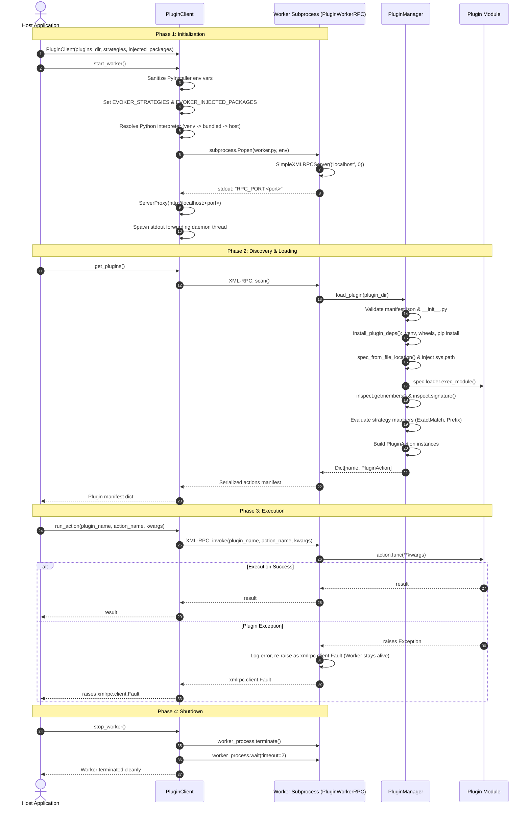
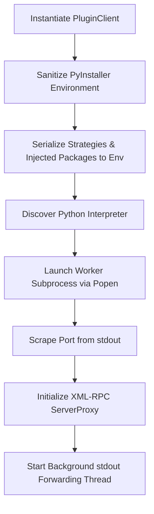
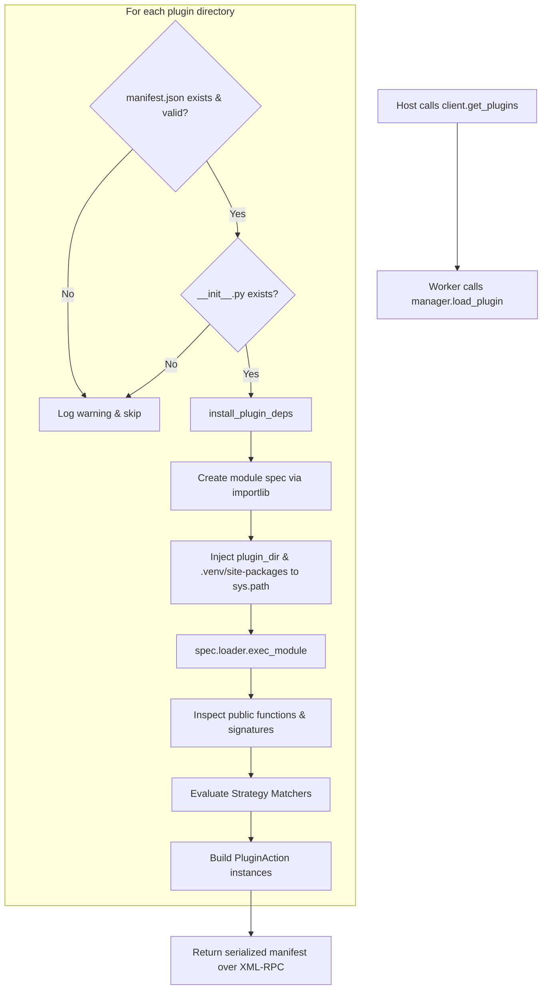
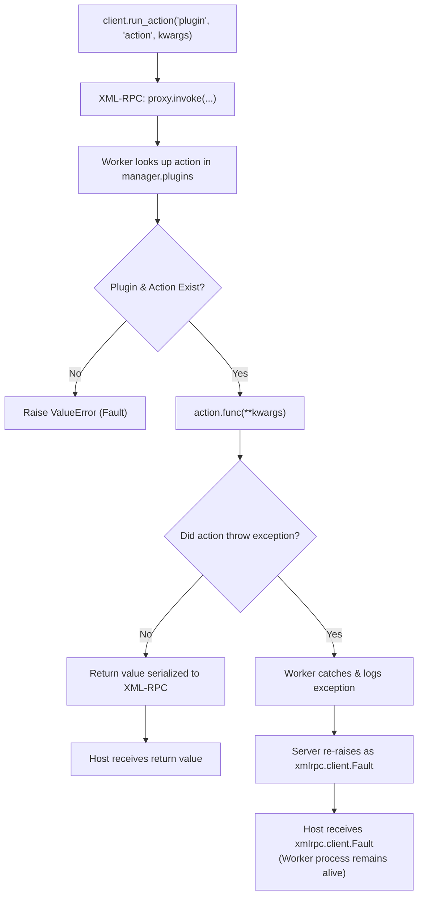
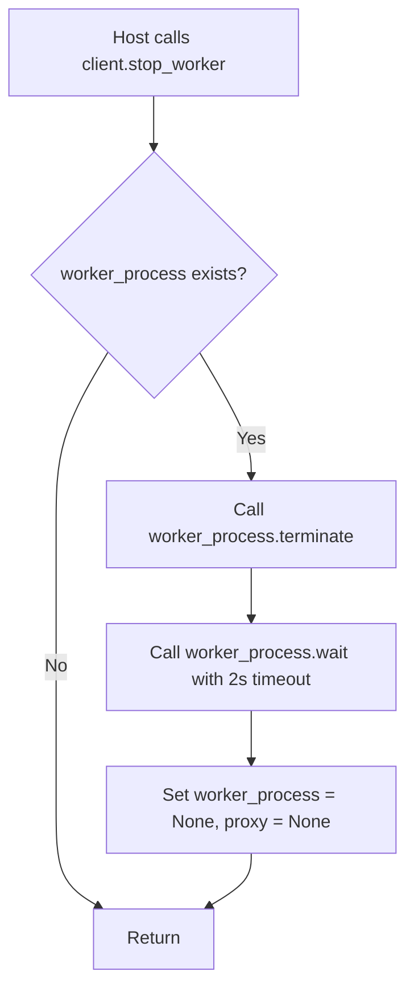

# Plugin Lifecycle

The Evoker plugin lifecycle encompasses four distinct phases: **Initialization**, **Discovery & Loading**, **Execution**, and **Shutdown**. 

This document provides a detailed end-to-end breakdown of each phase, detailing how the Host application and Worker subprocess coordinate via XML-RPC, environment serialization, dynamic module introspection, and process management.

---

## Lifecycle Overview Sequence

The sequence diagram below illustrates the complete interaction between the Host Application, `PluginClient`, Worker Subprocess (`PluginWorkerRPC`), `PluginManager`, and individual Plugin modules.



---

## Phase 1: Initialization

Initialization establishes the isolated subprocess runtime and sets up communication channels.



### 1. Client Configuration
The host initializes a `PluginClient` by providing the directory of plugins, an optional list of action matching strategies, and any host packages to inject into the worker:

```python
from pathlib import Path
from evoker_client.client import PluginClient

client = PluginClient(
    plugins_dir=Path("./plugins"),
    strategies=[
        {"type": "prefix", "value": "context_menu_"},
        {"type": "exact", "value": "on_start", "args": ["app_context"]}
    ],
    injected_packages=[Path("./host_api").parent]
)
client.start_worker()
```

### 2. Environment Sanitization
When running inside frozen executables (such as PyInstaller bundles), embedded runtime variables (`PYTHONPATH`, `PYTHONHOME`, `PATH`) can corrupt isolated external Python interpreters. `PluginClient` sanitizes the environment before spawning the child process:
- Checks for `ORIG_PYTHONPATH`, `ORIG_PYTHONHOME`, and `ORIG_PATH`.
- Restores original host variables or unsets modified variables.
- Sets `PYTHONPATH` to point to the raw `evoker` source (or the extracted `evoker_src` inside `sys._MEIPASS`).

### 3. Strategy and Package Serialization
The client serializes configuration data into JSON environment variables:
- `EVOKER_STRATEGIES`: Serialized list of strategy descriptor dictionaries.
- `EVOKER_INJECTED_PACKAGES`: Serialized list of resolved directory paths.

### 4. Interpreter Discovery & Subprocess Launch
The client resolves the target Python executable following the 3-tier hierarchy:
1. `<plugin_dir>/.venv`
2. Bundled `python-build-standalone`
3. Host `sys.executable`

The client spawns the worker using `subprocess.Popen`:

```python
cmd = [str(python_exe), "-u", "-m", "evoker.worker", str(self.plugins_dir)]
self.worker_process = subprocess.Popen(
    cmd,
    stdout=subprocess.PIPE,
    stderr=subprocess.STDOUT,
    text=True,
    env=env
)
```

### 5. Handshake & Port Negotiation
1. `worker.py` binds a `SimpleXMLRPCServer` to `("localhost", 0)`. The operating system allocates an available ephemeral TCP port.
2. The worker outputs `RPC_PORT:<assigned_port>` to `stdout` with an immediate flush.
3. `PluginClient` blocks on `readline()` (up to a 5-second timeout) to parse the assigned port number.
4. `PluginClient` establishes an `xmlrpc.client.ServerProxy(f"http://localhost:{port}")`.
5. A daemon thread is spawned in the host process to asynchronously read and forward any remaining worker `stdout` lines to the host terminal.

---

## Phase 2: Discovery & Loading

Discovery identifies, validates, installs dependencies for, and imports all plugins located within `plugins_dir`.



When the host invokes `client.get_plugins()`, the call is forwarded over XML-RPC to `PluginWorkerRPC.scan()`, which executes the following steps for each plugin folder:

### Step 1: Manifest & Entry Point Validation
The plugin directory must contain:
- `manifest.json`: Must be a valid JSON dictionary containing metadata (e.g., name, version, author, description).
- `__init__.py`: The Python module entry point.

If either file is missing or corrupt, `PluginManager` logs a warning and skips the directory.

### Step 2: Dependency Resolution & Wheel Caching (`install_plugin_deps`)
If the plugin contains a `requirements.txt` file, `evoker.installer` manages dependencies:
1. **Virtualenv Creation**: Creates a dedicated `.venv` in the plugin directory if it does not already exist.
2. **Offline Wheels Caching**:
   - Checks the `<plugin_dir>/wheels/` directory.
   - If missing or empty, runs `pip wheel -r requirements.txt -w wheels/` to build offline wheels.
3. **Dependency Installation**: Runs `pip install -r requirements.txt --find-links wheels/` using the plugin virtualenv interpreter.

### Step 3: Module Spec Creation & Path Injection
The module is loaded dynamically using Python's standard `importlib.util`:

```python
spec = importlib.util.spec_from_file_location(plugin_dir.name, init_path)
module = importlib.util.module_from_spec(spec)

# 1. Inject plugin root for relative imports
sys.path.insert(0, str(plugin_dir))

# 2. Inject .venv site-packages for third-party imports
venv_site_packages = plugin_dir / ".venv" / "Lib" / "site-packages"  # (or lib/pythonX.Y/site-packages)
if venv_site_packages.exists() and str(venv_site_packages) not in sys.path:
    sys.path.insert(1, str(venv_site_packages))
```

### Step 4: Module Execution
The module is executed in its own namespace via `spec.loader.exec_module(module)`. Once execution finishes, `sys.path.pop(0)` removes the plugin directory from the head of `sys.path`.

### Step 5: Function Introspection & Strategy Matching
`PluginManager._introspect_module(module)` iterates over all functions in the module:
1. **Filter Non-Public Functions**: Skips any function starting with an underscore (`_`).
2. **Signature Extraction**: Reads parameter names, default values, and type annotations via `inspect.signature(func)`. Missing type annotations default to `"str"`.
3. **Strategy Matching**:
   - Evaluates configured strategies (e.g., `ExactMatchStrategy`, `PrefixStrategy`).
   - If an exact match signature does not match expected parameter types, an error is logged and the action is ignored.
   - Generates action metadata (e.g., `menu_name` extracted from prefix).
4. **Action Storage**: Constructs a `PluginAction` dataclass containing the function reference, signature information, keyword status, and metadata.

The worker serializes the manifest and returns it to the host client.

---

## Phase 3: Execution

Execution handles dynamic invocation of plugin actions and guarantees fault isolation.



### 1. Action Invocation
When the host calls `client.run_action(plugin_name, action_name, kwargs)`:
1. `PluginClient` calls `self.proxy.invoke(plugin_name, action_name, kwargs)`.
2. `PluginWorkerRPC.invoke` retrieves the registered `PluginAction` from `self.manager.plugins`.
3. The worker executes `action.func(**kwargs)`.
4. The return value is returned across the XML-RPC boundary.

### 2. Fault Isolation & Error Handling
A critical design requirement of Evoker is that buggy or crashing plugins must not terminate the worker process:
- If a plugin function raises an unhandled Python exception (e.g., `ZeroDivisionError`, `KeyError`, custom exception), `worker.py` catches the error, logs it with traceback information, and re-raises it across XML-RPC.
- The standard XML-RPC server converts the Python exception into an `xmlrpc.client.Fault` object.
- The host `PluginClient` receives the `Fault` and raises it to the caller.
- **Worker Subprocess Stays Alive**: The worker process does not exit, and subsequent action calls to any plugin continue to function normally.

```python
# Host Error Handling Example
try:
    result = client.run_action("calculator_plugin", "divide", {"a": 10, "b": 0})
except xmlrpc.client.Fault as fault:
    print(f"Plugin execution failed with error: {fault.faultString}")
    # Worker is still running and ready for new calls!
```

---

## Phase 4: Shutdown

The shutdown phase ensures clean termination of worker subprocesses and releases system resources.



### 1. Terminating the Subprocess
When the host is closing or resetting a plugin domain, it calls `client.stop_worker()`:

```python
def stop_worker(self):
    if self.worker_process:
        self.worker_process.terminate()
        self.worker_process.wait(timeout=2)
        self.worker_process = None
```

1. **Process Termination**: Sends `SIGTERM` (POSIX) or calls `TerminateProcess` (Windows) on the worker subprocess.
2. **Graceful Wait**: Waits up to 2 seconds for the operating system process table to clean up the process handle.
3. **Reference Cleanup**: Resets `self.worker_process` and `self.proxy` to `None`.

---

## Complete Lifecycle Example

```python
from pathlib import Path
from evoker_client.client import PluginClient

def main():
    plugins_path = Path("./plugins")
    
    # 1. Phase 1: Initialization
    client = PluginClient(
        plugins_dir=plugins_path,
        strategies=[{"type": "prefix", "value": "context_menu_"}]
    )
    client.start_worker()

    try:
        # 2. Phase 2: Discovery & Loading
        manifest = client.get_plugins()
        print(f"Discovered {len(manifest)} plugins.")

        # 3. Phase 3: Execution
        if "hello_world_plugin" in manifest:
            res = client.run_action("hello_world_plugin", "greet", {"name": "Developer"})
            print(f"Action result: {res}")

    finally:
        # 4. Phase 4: Shutdown
        client.stop_worker()
        print("Worker stopped.")

if __name__ == "__main__":
    main()
```
