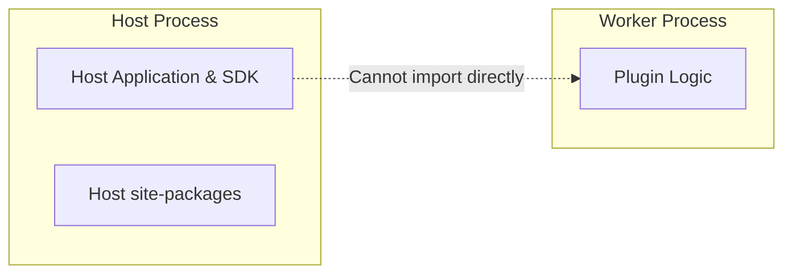
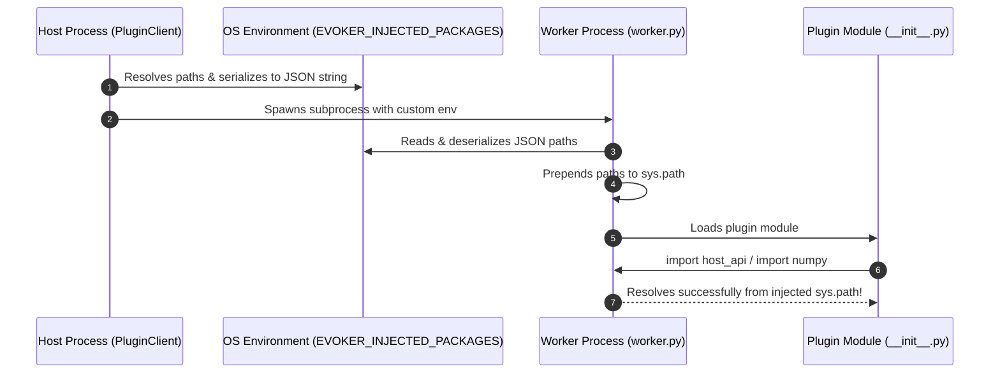

# Custom API Injection

In Evoker, plugins run in separate subprocesses to provide fault isolation and safety. However, isolated plugins frequently need access to shared host utilities, application SDKs, or pre-installed third-party libraries.

Evoker provides a clean, zero-overhead mechanism called **Custom API Injection** to bridge this gap.

---

## The Problem: Process Isolation Boundaries

When a plugin runs inside an isolated worker process, it operates in a separate Python runtime:



Because memory spaces and module namespaces are completely disjoint:
- Plugins cannot `import my_host_app_sdk` directly.
- Plugins cannot call host in-memory functions or share class instances.
- Re-installing common libraries (such as `numpy`, `pandas`, or `rich`) in every plugin's `.venv` wastes disk space and slows down startup.

---

## The Solution: `injected_packages`

When initializing `PluginClient`, you can pass a list of filesystem paths via the `injected_packages` parameter:

```python
from pathlib import Path
import sys
from evoker_client.client import PluginClient

host_api_dir = Path(__file__).parent / "host_api"
host_site_packages = Path(sys.prefix) / "Lib" / "site-packages"

client = PluginClient(
    plugins_dir=Path("plugins"),
    injected_packages=[
        host_api_dir.parent,    # Allows importing host_api
        host_site_packages      # Allows importing host-installed libraries
    ]
)
```

Evoker automatically propagates these paths to the worker process and injects them into the worker's `sys.path`.

---

## How It Works Under the Hood

The injection mechanism operates through environment variable serialization and runtime `sys.path` manipulation:



### 1. Host Resolution & Serialization
In `client.py`, paths provided to `injected_packages` are converted to absolute paths and serialized as a JSON list into the `EVOKER_INJECTED_PACKAGES` environment variable before launching the subprocess:

```python
# Inside client.py
if self.injected_packages is not None:
    env["EVOKER_INJECTED_PACKAGES"] = json.dumps(
        [str(p.resolve()) for p in self.injected_packages]
    )
```

### 2. Worker Deserialization & Path Prepending
When `worker.py` boots, it immediately checks for `EVOKER_INJECTED_PACKAGES` before importing plugins:

```python
# Inside worker.py
def parse_injected_packages(env_val: str):
    try:
        injected = json.loads(env_val)
        if isinstance(injected, list):
            for p in reversed(injected):
                if p not in sys.path:
                    sys.path.insert(0, p)
    except Exception as e:
        logger.error(f"Failed to parse EVOKER_INJECTED_PACKAGES: {e}")

if "EVOKER_INJECTED_PACKAGES" in os.environ:
    parse_injected_packages(os.environ["EVOKER_INJECTED_PACKAGES"])
```

### 3. Native Plugin Imports
Plugins can now seamlessly import modules from those directories as if they were standard installed packages:

```python
# Inside plugins/my_plugin/__init__.py
from host_api.telemetry import record_metric
from host_api.logging_utils import get_logger
```

---

## Example: Building a Shared Host API

Let's look at an end-to-end example where a host provides a shared logging and telemetry SDK to plugins.

### Project Layout

```text
my_application/
├── host_api/
│   ├── __init__.py
│   ├── telemetry.py
│   └── logging_utils.py
├── plugins/
│   └── telemetry_plugin/
│       ├── manifest.json
│       └── __init__.py
└── host.py
```

### 1. Defining the Shared SDK (`host_api/telemetry.py`)

```python
# host_api/telemetry.py
import datetime

def record_metric(name: str, value: float) -> str:
    timestamp = datetime.datetime.utcnow().isoformat()
    entry = f"[{timestamp}] METRIC: {name} = {value}"
    print(f"[Host SDK] {entry}")
    return entry
```

### 2. Using the Shared SDK in a Plugin (`plugins/telemetry_plugin/__init__.py`)

The plugin imports `host_api.telemetry` directly:

```python
# plugins/telemetry_plugin/__init__.py
from host_api.telemetry import record_metric

def process_batch(batch_id: int, items_count: int) -> dict:
    print(f"[Plugin] Processing batch {batch_id} with {items_count} items...")
    
    # Use the injected host SDK function
    log_entry = record_metric(f"batch_{batch_id}_size", float(items_count))
    
    return {
        "batch_id": batch_id,
        "status": "success",
        "log_entry": log_entry
    }
```

### 3. Configuring the Host (`host.py`)

```python
from pathlib import Path
from evoker_client.client import PluginClient

base_dir = Path(__file__).parent
host_api_parent = base_dir  # base_dir contains the host_api/ folder

# Initialize client and inject host_api
client = PluginClient(
    plugins_dir=base_dir / "plugins",
    injected_packages=[host_api_parent]
)

client.start_worker()

try:
    result = client.run_action("telemetry_plugin", "process_batch", {
        "batch_id": 42,
        "items_count": 500
    })
    print("[Host] Result:", result)
finally:
    client.stop_worker()
```

---

## Injecting Host Dependencies (`site-packages`)

In many applications, the host environment already has heavy packages installed (such as `numpy`, `scipy`, `polars`, or `rich`). Rather than forcing every plugin to run `pip install` in its own virtual environment, you can inject the host's `site-packages` directory directly.

### Locating `site-packages` Dynamically

```python
import sys
import os
from pathlib import Path
from evoker_client.client import PluginClient

def get_host_site_packages() -> Path:
    prefix = Path(sys.prefix)
    if os.name == "nt":
        return prefix / "Lib" / "site-packages"
    else:
        # Linux/macOS: Lib/pythonX.Y/site-packages
        py_version = f"python{sys.version_info.major}.{sys.version_info.minor}"
        return prefix / "lib" / py_version / "site-packages"

site_packages = get_host_site_packages()

client = PluginClient(
    plugins_dir=Path("plugins"),
    injected_packages=[
        Path("host_api").parent,
        site_packages
    ]
)
```

:::tip Benefits of Site-Packages Injection
1. **Instant Plugin Startup**: Eliminates the overhead of creating `.venv` directories and downloading wheels during plugin load.
2. **Reduced Disk Usage**: Prevents duplicating hundreds of megabytes of compiled C-extensions across multiple plugins.
3. **Guaranteed Version Compatibility**: Ensures both the host and plugins compile and execute against the exact same ABI and package versions.
:::

---

## Architectural Comparison: Grafana Plugin SDK

The architecture of Evoker's API Injection is conceptually modeled after modern extensibility frameworks like **Grafana Backend Plugins**:

| Feature | Grafana Backend Plugins | Evoker Plugin System |
| :--- | :--- | :--- |
| **Isolation Model** | Sandboxed Go / gRPC subprocesses | Sandboxed Python / XML-RPC subprocesses |
| **Shared SDK** | `grafana-plugin-sdk-go` injected via protocol & shared build deps | `host_api` packages injected via `sys.path` prepending |
| **Data Exchange** | Arrow DataFrames over gRPC stream | XML-RPC primitives; optional host-defined IPC for large binary data |
| **Extensibility** | Plugins interact through standard SDK interfaces without host memory coupling | Plugins import host-provided modules while preserving process boundary isolation |

---

## Best Practices

1. **Keep Injected APIs Stateless & Decoupled**: Since the plugin executes in a separate process, do not attempt to share in-memory singletons or global mutable state through injected modules. Injected modules should provide utility functions, protocol definitions, serializers, or stateless client interfaces.
2. **Use Relative Imports Carefully**: Ensure injected package directories are structured with clear package names (e.g. `host_api`) to avoid shadowing standard library modules.
3. **Custom IPC Mechanisms**: If your application works with large datasets, use injected APIs to supply host-defined IPC utilities (such as shared memory or file serializers) across all plugins seamlessly.
