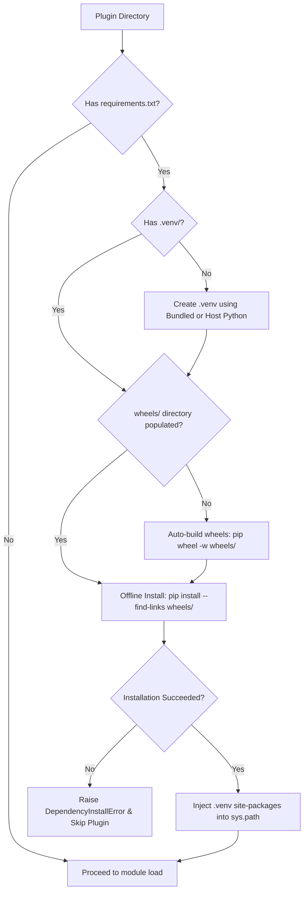

# Dependency Management

Plugins often require third-party libraries (e.g. `scikit-learn`, `requests`, `polars`) that are not part of the host Python runtime.

Evoker provides a fully automated, resilient dependency management system that creates isolated virtual environments, caches offline binary wheels, handles air-gapped deployments, and recovers gracefully from installation errors.

---

## How Dependency Installation Works

When `PluginManager.load_plugin(plugin_dir)` is called, Evoker inspects the directory for a `requirements.txt` file. If found, `evoker.installer` initiates an automated resolution pipeline:



---

## 1. Automatic Virtual Environments (`.venv`)

If a plugin contains `requirements.txt` and has not been initialized:
1. Evoker locates the target Python interpreter:
   - **Bundled Standalone Python**: Checks for an embedded standalone Python interpreter in `evoker/pythons/`.
   - **Host Python Fallback**: If no bundled standalone Python is found, falls back to `sys.executable`.
2. Creates an isolated virtual environment at `<plugin_dir>/.venv`:
   ```bash
   <python_exe> -m venv <plugin_dir>/.venv
   ```
3. Activates the environment by resolving the executable (`.venv/Scripts/python.exe` on Windows, `.venv/bin/python` on Linux/macOS).

---

## 2. Automatic Wheel Caching

To optimize subsequent boots and prepare plugins for offline redistribution, Evoker automatically manages a `wheels/` cache directory:

1. **Wheel Building**: If `<plugin_dir>/wheels/` does not exist or is empty, Evoker runs:
   ```bash
   pip wheel -r requirements.txt -w <plugin_dir>/wheels
   ```
2. **Local Installation**: Evoker then executes the install command using `--find-links`:
   ```bash
   pip install -r requirements.txt --find-links <plugin_dir>/wheels
   ```

Once wheels are generated, all future installations for that plugin (on the same platform/architecture) will install directly from the local `.whl` files without making internet queries.

---

## 3. Offline & Air-Gapped Deployment

For secure enterprise environments, air-gapped systems, or embedded desktop bundles where target machines lack internet access, developers can pre-build wheels during build time.

### Pre-bundling Steps:

1. On a machine with internet access (matching the target OS and Python version), populate the plugin's `wheels/` directory:
   ```bash
   cd plugins/my_plugin
   pip wheel -r requirements.txt -w wheels/
   ```
2. The resulting directory structure looks like:
   ```text
   plugins/
   └── my_plugin/
       ├── manifest.json
       ├── __init__.py
       ├── requirements.txt
       └── wheels/
           ├── certifi-2024.2.2-py3-none-any.whl
           ├── charset_normalizer-3.3.2-cp311-cp311-win_amd64.whl
           ├── idna-3.6-py3-none-any.whl
           ├── requests-2.31.0-py3-none-any.whl
           └── urllib3-2.2.1-py3-none-any.whl
   ```
3. Distribute the `my_plugin` directory. When Evoker launches on an air-gapped machine, it detects the existing `wheels/` directory and installs entirely offline via `--find-links`.

---

## 4. Error Handling & Graceful Degradation

If a dependency fails to compile, is missing binary wheels, or cannot be installed due to permission errors:

1. `installer.py` catches `subprocess.CalledProcessError` and raises a `DependencyInstallError` containing the full compiler/pip stderr output.
2. `PluginManager.load_plugin()` intercepts `DependencyInstallError`:
   ```python
   # Inside manager.py
   try:
       install_plugin_deps(plugin_dir)
   except DependencyInstallError:
       logger.warning(f"Skipping {plugin_dir}: Dependency installation failed.")
       return None
   ```
3. **The host application and worker do not crash.** The faulty plugin is cleanly skipped, logged as a warning, and all other plugins continue to function normally.

---

## 5. Alternative: Host Dependency Injection

Creating per-plugin virtual environments provides complete isolation, but can be redundant if multiple plugins share heavy packages (e.g. `numpy`, `torch`, `pyarrow`).

As an alternative to `requirements.txt`, hosts can share their existing `site-packages` using `injected_packages`:

```python
import sys
import os
from pathlib import Path
from evoker_client.client import PluginClient

# Locate host site-packages
if os.name == "nt":
    host_site_packages = Path(sys.prefix) / "Lib" / "site-packages"
else:
    host_site_packages = Path(sys.prefix) / "lib" / f"python{sys.version_info.major}.{sys.version_info.minor}" / "site-packages"

# Inject host libraries into plugin worker
client = PluginClient(
    plugins_dir=Path("plugins"),
    injected_packages=[host_site_packages]
)
```

### When to Use Each Approach

| Approach | Best For | Pros | Cons |
| :--- | :--- | :--- | :--- |
| **`requirements.txt` + `.venv`** | Independent third-party plugins with custom or conflicting package versions | True version isolation per plugin | Slower initial startup; uses disk space per venv |
| **Host `injected_packages`** | First-party or coordinated plugins sharing heavy scientific/data libraries | Instant startup; 0MB extra disk; shared pre-warmed dependencies | Plugins share the host's version constraints |
