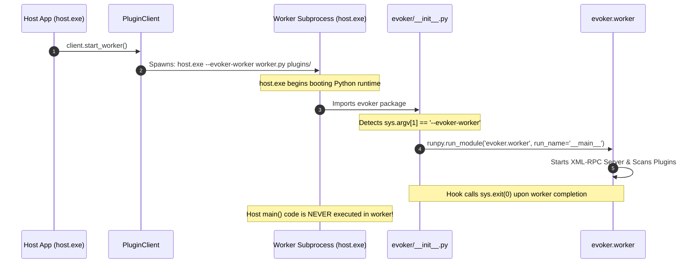

# PyInstaller Packaging

Packaging a dynamic plugin-based Python application into a standalone executable presents unique challenges: plugins must be discovered at runtime, external virtual environments need access to host source packages, and subprocesses must spawn without re-triggering main GUI or CLI routines.

Evoker provides built-in PyInstaller integration designed specifically for robust standalone desktop and server distribution.

---

## 1. Why One-Dir (`-D` / `COLLECT`) Mode is Required

When compiling your host application with PyInstaller, **you must use One-Dir mode (`-D`)**, not One-File mode (`-F`).

### Why One-File Mode Fails for Plugin Architectures:
- **Ephemeral Extraction**: One-File mode unzips application binaries into a temporary `_MEIxxxxxx` directory on every run and wipes it upon exit.
- **Destroyed Virtual Environments**: Any plugin virtual environments (`.venv`) or cached wheels created at runtime would be deleted when the process terminates.
- **External Extensibility**: End users cannot drop new plugins into a `plugins/` folder alongside a single `.exe` file.

In One-Dir mode, the application sits in a permanent folder (e.g. `dist/host/`), allowing plugins, wheels, and configurations to persist indefinitely.

---

## 2. Built-in PyInstaller Hooks

When `evoker_evoker` is installed in your development environment, it automatically registers PyInstaller hooks via the `pyinstaller40` entry point in `setup.py`:

```python
entry_points={
    'pyinstaller40': [
        'hook-dirs = evoker_client._pyinstaller:get_hook_dirs',
    ]
}
```

### What the Hook (`hook-evoker.py`) Does Automatically:

1. **Bundles Raw Source Code (`_internal/evoker_src/`)**:
   PyInstaller compiles all Python modules into a closed `PYZ` archive. However, if a plugin creates an external `.venv`, that external Python interpreter cannot inspect inside the frozen PYZ archive. The hook copies the raw `evoker` `.py` files to `_internal/evoker_src/` so external Python interpreters can import `evoker` via `PYTHONPATH`.
2. **Bundles Standalone Python Distributions**:
   Packages any bundled Python runtimes located in `evoker/pythons/` into the distribution directory.
3. **Registers Hidden Imports**:
   Explicitly adds `evoker.worker` to `hiddenimports` so PyInstaller packages the worker entry point even though it is invoked via subprocess.
4. **Deploys Built Documentation**:
   Copies built HTML documentation assets directly into `dist/<app>/plugins/docs`.

---

## 3. The `--evoker-worker` Interception Trick

When your frozen application launches on a user machine without an external Python interpreter, `PluginClient` uses the bundled executable itself (`sys.executable`) to spawn the worker subprocess.

Normally, running `host.exe` would start a second copy of the entire host application, leading to infinite subprocess recursion.

Evoker resolves this using the `--evoker-worker` interception trick:



### Interception Implementation (`evoker/__init__.py`):

```python
import sys

if len(sys.argv) >= 3 and sys.argv[1] == '--evoker-worker':
    import runpy
    
    # Strip --evoker-worker argument
    sys.argv = ["evoker.worker"] + sys.argv[3:]
    
    # Run the worker module directly from the embedded PYZ archive
    runpy.run_module("evoker.worker", run_name="__main__")
    
    # Exit immediately to prevent host application code from running
    sys.exit(0)
```

---

## 4. Path Resolution with `get_app_dir`

Inside a frozen PyInstaller bundle, `__file__` often points to the internal `_internal/` directory or transient extraction path.

Evoker provides a helper function `get_app_dir(__file__)` in `evoker_client.utils` that reliably resolves to the directory containing the `.exe` when frozen, while falling back to standard script parent paths during development:

```python
from pathlib import Path
from evoker_client.utils import get_app_dir
from evoker_client.client import PluginClient

# Resolves to the folder containing host.exe when frozen
base_dir = get_app_dir(__file__)

# Point to external plugins and host_api directories
client = PluginClient(
    plugins_dir=base_dir / "plugins",
    injected_packages=[base_dir / "host_api"]
)
```

---

## 5. PyInstaller Spec File (`host.spec`)

Below is a complete, minimal `host.spec` configuration for packaging a Evoker host application in One-Dir mode:

```python
# -*- mode: python ; coding: utf-8 -*-
from pathlib import Path

block_cipher = None

a = Analysis(
    ['examples/host.py'],
    pathex=['src'],
    binaries=[],
    datas=[
        ('src/evoker', 'src/evoker'),
    ],
    hiddenimports=['evoker.worker'],
    hookspath=[],
    hooksconfig={},
    runtime_hooks=[],
    excludes=[],
    noarchive=False,
)

pyz = PYZ(a.pure, a.zipped_data, cipher=block_cipher)

exe = EXE(
    pyz,
    a.scripts,
    [],
    exclude_binaries=True,
    name='host',
    debug=False,
    bootloader_ignore_signals=False,
    strip=False,
    upx=True,
    console=True,
)

coll = COLLECT(
    exe,
    a.binaries,
    a.zipfiles,
    a.datas,
    strip=False,
    upx=True,
    upx_exclude=[],
    name='host',
)
```

---

## 6. Post-Build Deployment Script (`build.ps1`)

After PyInstaller builds the `dist/host` directory, mutable directories (like `plugins/`, `tools/`, and `host_api/`) must be deployed alongside the `.exe`:

```powershell
# build.ps1 - Automated PyInstaller build & distribution script

Write-Host "[*] Cleaning previous build artifacts..." -ForegroundColor Cyan
Remove-Item -Recurse -Force -ErrorAction SilentlyContinue dist, build

Write-Host "[*] Compiling application with PyInstaller..." -ForegroundColor Cyan
pyinstaller --clean host.spec

$distDir = "dist/host"

Write-Host "[*] Deploying external directories alongside host.exe..." -ForegroundColor Cyan

# 1. Copy plugins directory
if (Test-Path "examples/plugins") {
    Copy-Item -Recurse -Force "examples/plugins" "$distDir/plugins"
    Write-Host "  -> Copied plugins/" -ForegroundColor Green
}

# 2. Copy host_api directory
if (Test-Path "examples/host_api") {
    Copy-Item -Recurse -Force "examples/host_api" "$distDir/host_api"
    Write-Host "  -> Copied host_api/" -ForegroundColor Green
}

# 3. Copy optional tools or assets
if (Test-Path "tools") {
    Copy-Item -Recurse -Force "tools" "$distDir/tools"
    Write-Host "  -> Copied tools/" -ForegroundColor Green
}

Write-Host "`n[✓] Standalone build complete in $distDir" -ForegroundColor Green
Write-Host "You can now run: .\dist\host\host.exe" -ForegroundColor Yellow
```

---

## Summary Checklist for PyInstaller Builds

- [x] Use **One-Dir mode** (`COLLECT` in `.spec` or `pyinstaller -D`).
- [x] Use `get_app_dir(__file__)` to reference `plugins` and `host_api` paths.
- [x] Ensure `evoker_evoker` hooks are active (`hiddenimports=['evoker.worker']`).
- [x] Deploy `plugins/` and `host_api/` folders alongside `host.exe` post-build.
- [x] Pre-populate `wheels/` in plugin folders for air-gapped environments.
