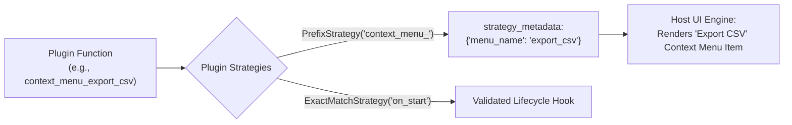

# Strategy Patterns

In Evoker, **Strategies** are declarative introspection rules that match plugin function names, validate their parameter signatures, and extract structural metadata. They serve as the critical bridge between raw Python functions in a plugin and high-level host concepts like lifecycle hooks, dynamic menu bars, toolbars, and event listeners.

---

## What Are Strategies?

When `PluginManager` introspects a plugin module, it discovers every public function. Without strategies, the host would see a flat list of functions with no knowledge of which functions should trigger on startup, which should appear in a context menu, or which require specific signatures.

Strategies inspect each function during discovery and attach **strategy metadata**:



When the host queries `client.get_plugins()`, this metadata is returned as part of the manifest, enabling the host to bind functions to UI actions automatically.

---

## Built-in Strategies

Evoker provides two core strategy implementations: `ExactMatchStrategy` and `PrefixStrategy`.

### 1. `ExactMatchStrategy`

`ExactMatchStrategy` matches a function by its exact name **and validates its parameter signature**.

It is commonly used for system lifecycle hooks (such as `on_start`, `on_stop`, or `on_configure`), where the host expects specific argument names when invoking the hook.

```python
ExactMatchStrategy(exact_name="on_start", expected_args=["app_context"])
```

#### How It Works:
- If a function matches `exact_name`, the strategy checks whether the parameter names match `expected_args` in exact order.
- If the signature **matches**, it returns an empty metadata dictionary `{}` and marks the action as a recognized keyword action (`is_keyword = True`).
- If the signature **does not match**, it logs a warning and raises a `ValueError("Signature mismatch")`, which causes Evoker to **reject and ignore** the invalid function.

```python
# Valid Match
def on_start(app_context):
    print("Plugin starting with context:", app_context)

# Rejected with warning (Wrong parameter name 'ctx')
def on_start(ctx):
    pass
```

### 2. `PrefixStrategy`

`PrefixStrategy` matches any function whose name starts with a defined prefix. It strips the prefix and extracts the remaining string into the `menu_name` metadata field.

It is designed for dynamic UI generation, such as context menus, toolbar buttons, or macro registries:

```python
PrefixStrategy(prefix="context_menu_")
```

#### How It Works:
- A function named `context_menu_say_hello()` matches the prefix `context_menu_`.
- The strategy extracts `"menu_name": "say_hello"`.
- The host UI inspects this metadata and dynamically generates a menu item labeled `"say_hello"`.

```python
# Matched by PrefixStrategy("context_menu_")
# Metadata extracted: {"menu_name": "generate_report"}
def context_menu_generate_report():
    print("Generating report from UI context menu...")
```

---

## Cross-Process Serialization

Because the host application and plugin workers run in separate processes, strategy definitions are configured on the host as JSON-serializable dictionaries and reconstructed inside the worker.

### Defining Strategies in `PluginClient`

When instantiating `PluginClient`, provide the `strategies` list:

```python
from pathlib import Path
from plugin_host.client import PluginClient

client = PluginClient(
    plugins_dir=Path("plugins"),
    strategies=[
        {"type": "exact", "value": "on_start", "args": ["app_context"]},
        {"type": "exact", "value": "on_shutdown", "args": []},
        {"type": "prefix", "value": "context_menu_"},
        {"type": "prefix", "value": "toolbar_action_"}
    ]
)
```

### Under the Hood Serialization

1. **Host Side (`client.py`)**: The `strategies` configuration list is converted to JSON and stored in the `EVOKER_STRATEGIES` environment variable before spawning `worker.py`.
2. **Worker Side (`worker.py`)**: During initialization, `worker.py` parses `EVOKER_STRATEGIES` and instantiates the corresponding `PrefixStrategy` and `ExactMatchStrategy` objects:

```python
# worker.py
def parse_strategies(env_val: str):
    strategies_config = json.loads(env_val)
    strategies = []
    for config in strategies_config:
        if config.get("type") == "prefix":
            strategies.append(PrefixStrategy(config["value"]))
        elif config.get("type") == "exact":
            strategies.append(ExactMatchStrategy(config["value"], config.get("args", [])))
    return strategies
```

---

## Host UI Generation Example

The following example demonstrates how a host application uses strategies to discover plugins, execute lifecycle hooks, and build dynamic UI menus.

```python
import sys
from pathlib import Path
from plugin_host.client import PluginClient

def main():
    client = PluginClient(
        plugins_dir=Path("plugins"),
        strategies=[
            {"type": "exact", "value": "on_start", "args": ["app_context"]},
            {"type": "prefix", "value": "context_menu_"}
        ]
    )
    
    client.start_worker()
    
    try:
        # 1. Discover all plugins and their strategy metadata
        manifest = client.get_plugins()
        
        # 2. Execute on_start lifecycle hooks for all plugins
        for plugin_name, actions in manifest.items():
            if "on_start" in actions:
                print(f"Booting plugin lifecycle hook: {plugin_name}.on_start")
                client.run_action(plugin_name, "on_start", {"app_context": {"theme": "dark", "version": "2.0"}})
        
        # 3. Dynamically build UI Context Menus
        print("\n--- Registering Dynamic Context Menus ---")
        for plugin_name, actions in manifest.items():
            for action_name, action_info in actions.items():
                metadata = action_info.get("strategy_metadata")
                if metadata and "menu_name" in metadata:
                    menu_label = metadata["menu_name"].replace("_", " ").title()
                    print(f"Adding Menu Item: [{menu_label}] -> calls {plugin_name}.{action_name}()")
                    
                    # When clicked in UI, the host runs:
                    # client.run_action(plugin_name, action_name, {})

    finally:
        client.stop_worker()

if __name__ == "__main__":
    main()
```

---

## Writing Custom Strategies

You can extend Evoker by creating your own custom strategy classes. All strategies inherit from the abstract base class `PluginStrategy`.

### The `PluginStrategy` Interface

```python
from abc import ABC, abstractmethod
from typing import Dict, Any, Optional

class PluginStrategy(ABC):
    @abstractmethod
    def match(self, name: str, sig_info: Dict[str, Any]) -> Optional[Dict[str, Any]]:
        """
        Evaluates a function by name and signature.
        
        :param name: The function name (e.g. 'handle_user_event').
        :param sig_info: Signature details: {'parameters': {'param_name': {'type': 'str', 'required': True}}}
        :return: 
            - Dict[str, Any]: If matched, returns metadata dict attached to the action.
            - None: If not matched, evaluation falls through to subsequent strategies.
            - Raises ValueError: Rejects and ignores the function entirely (e.g. on invalid signature).
        """
        pass
```

### Custom Strategy Example: `RegexMatchStrategy`

Here is an example strategy that matches functions matching a regex pattern and extracts named capture groups into metadata:

```python
import re
from typing import Dict, Any, Optional
from plugin_host.manager import PluginStrategy

class RegexMatchStrategy(PluginStrategy):
    def __init__(self, pattern: str):
        self.regex = re.compile(pattern)

    def match(self, name: str, sig_info: Dict[str, Any]) -> Optional[Dict[str, Any]]:
        match = self.regex.match(name)
        if match:
            # Return captured groups as metadata
            return match.groupdict()
        return None

# Usage in a Worker/Manager:
# Regex: matches "on_event_<event_name>" e.g., on_event_file_saved
strategy = RegexMatchStrategy(r"^on_event_(?P<event_type>[a-zA-Z0-9_]+)$")
```

---

## Strategy Match Rules & Summary

| Result of `match()` | Action Taken by `PluginManager` |
| :--- | :--- |
| **Dictionary `{...}`** | Matches the strategy. Marks `is_keyword = True`, assigns `strategy_metadata`, and stops further strategy checks for this action. |
| **`None`** | No match. The manager checks the next strategy in `self.strategies`. If none match, the action is exported as a standard action (`is_keyword = False`). |
| **Raises `ValueError`** | Rejects the action. The function is completely excluded from the plugin manifest and logged with a warning. |
