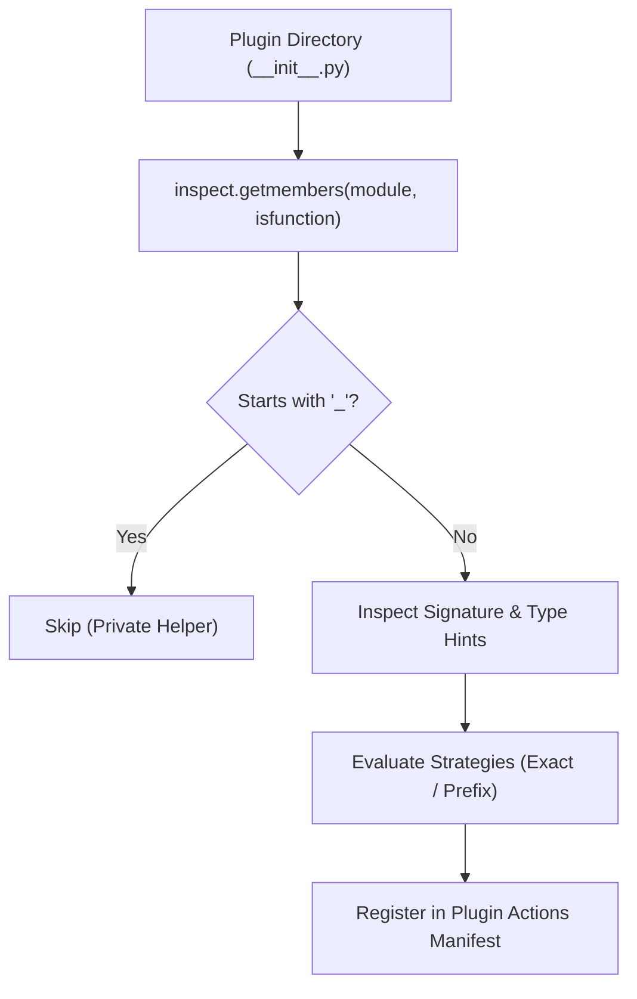

# Writing Plugins

Plugins in Evoker are self-contained Python packages that execute in dedicated, isolated worker processes. They expose capabilities to the host application through automatically introspected public functions and metadata manifests.

This guide covers everything you need to build, structure, and optimize plugins for the Evoker architecture.

---

## Plugin Directory Structure

Every plugin in Evoker lives in its own subdirectory inside the designated plugins directory (e.g., `plugins/<plugin_name>/`).

A minimal plugin requires only two files:
1. `manifest.json` — Describes the plugin name, version, and metadata.
2. `__init__.py` — Contains the plugin's entry point functions and business logic.

Optionally, plugins can declare dependencies and offline caches:

```text
plugins/
└── data_processor/
    ├── manifest.json         # (Required) Plugin metadata
    ├── __init__.py           # (Required) Public exported actions & entry points
    ├── helper_module.py      # (Optional) Internal helper modules
    ├── requirements.txt      # (Optional) Third-party pip dependencies
    └── wheels/               # (Optional) Pre-cached wheels for air-gapped environments
        └── numpy-1.26.4-cp311-cp311-win_amd64.whl
```

---

## The Plugin Manifest (`manifest.json`)

The manifest file is the declarative descriptor of the plugin. When Evoker scans a plugin directory, it first loads and validates `manifest.json`.

### Schema

```json
{
  "name": "data_processor",
  "version": "1.0.0",
  "description": "Calculates statistical summaries and transforms tabular data."
}
```

### Manifest Fields

| Field | Type | Description |
| :--- | :--- | :--- |
| `name` | `string` | Unique identifier for the plugin. Used as the namespace when the host invokes actions via `client.run_action("data_processor", ...)`. |
| `version` | `string` | Semantic version string (e.g., `1.0.0`, `0.2.1-beta`). |
| `description` | `string` | Human-readable explanation of what the plugin does. |

:::warning Manifest Validation
If `manifest.json` is missing or is not valid JSON, `PluginManager` logs a warning and skips loading the plugin entirely.
:::

---

## Function Discovery & Export Rules

Evoker uses Python's runtime inspection (`inspect` module) to dynamically discover actions inside each plugin's `__init__.py`.

### Discovery Rules

1. **Public Functions are Exported**: Any top-level function defined in `__init__.py` that **does not** start with an underscore (`_`) is automatically cataloged as an exported action.
2. **Private Functions are Excluded**: Functions prefixed with an underscore (`_helper()`, `_internal_compute()`) are treated as private implementation details and ignored during introspection.
3. **Module Imports**: Imported functions are introspected if they are bound to the module namespace, but standard practice is to define public handler functions directly or re-export them cleanly.



---

## Type Hints & Signature Introspection

Evoker inspects function signatures to provide rich runtime metadata to the host application. This allows host UIs to generate dynamic forms, validate inputs, and display documentation tooltips.

### Type Annotations

- **Typed Parameters**: When a parameter has a type hint (`param: int`), Evoker extracts the type name (`"int"`, `"float"`, `"str"`, `"bool"`, `"dict"`, `"list"`).
- **Untyped Parameters**: If a parameter lacks a type hint, Evoker falls back to `"str"` and logs a warning:
  ```text
  WARNING: Argument 'count' in action 'process' lacks type hint. Defaulting to str.
  ```
- **Optional Parameters**: Parameters with default values (e.g., `limit: int = 100`) are marked as `required: False`. Parameters without default values are marked as `required: True`.
- **`self` Parameter**: If present, `self` is automatically excluded from introspection metadata.

### Signature Metadata Format

When `client.get_plugins()` is called on the host, the worker returns a dictionary representing the discovered signatures:

```python
{
    "data_processor": {
        "calculate_stats": {
            "name": "calculate_stats",
            "signature": {
                "parameters": {
                    "data": {"type": "list", "required": True},
                    "threshold": {"type": "float", "required": False}
                }
            },
            "is_keyword": False,
            "strategy_metadata": None
        }
    }
}
```

---

## Return Values & Serialization

Evoker communicates between the host process and isolated worker processes using an XML-RPC control channel.

### Supported XML-RPC Types

Functions can directly return standard primitive and nested data types supported by XML-RPC:
- Strings (`str`)
- Integers (`int`)
- Floats (`float`)
- Booleans (`bool`)
- Dictionaries (`dict`, with string keys)
- Lists / Arrays (`list`)
- `None` (supported with `allow_none=True`)

### Large Datasets and Custom IPC

Because XML-RPC serializes payloads as ASCII XML text, transferring very large datasets directly through return values may incur serialization overhead.

For high-throughput or large data workflows, host applications can implement their own custom IPC mechanisms (such as shared memory, binary files, or local sockets) and inject helper utilities into plugin worker processes via [Custom API Injection](./api-injection.md).

---

## Complete Plugin Example

Below is a complete, production-ready plugin demonstrating typed arguments, default values, private helpers, lifecycle hooks, and structured return values.

### Directory Layout

```text
plugins/
└── text_analyzer/
    ├── manifest.json
    └── __init__.py
```

### `manifest.json`

```json
{
  "name": "text_analyzer",
  "version": "1.2.0",
  "description": "Performs text sentiment analysis and token frequency aggregation."
}
```

### `__init__.py`

```python
import re
from typing import Dict, List, Any

# ---------------------------------------------------------------------------
# Private Helper Functions (Ignored by Evoker discovery)
# ---------------------------------------------------------------------------

def _tokenize(text: str) -> List[str]:
    """Internal helper to split text into alphanumeric tokens."""
    return re.findall(r"\b\w+\b", text.lower())

def _calculate_frequencies(tokens: List[str]) -> Dict[str, int]:
    """Internal helper to count token occurrences."""
    freqs: Dict[str, int] = {}
    for token in tokens:
        freqs[token] = freqs.get(token, 0) + 1
    return freqs


# ---------------------------------------------------------------------------
# Lifecycle Hooks & Strategies
# ---------------------------------------------------------------------------

def on_start(app_context: Dict[str, Any]) -> None:
    """Exact match strategy: Called automatically when the host boots."""
    print(f"[text_analyzer] Plugin initialized with context keys: {list(app_context.keys())}")


def context_menu_summarize_selection() -> Dict[str, str]:
    """Prefix strategy: Bound to UI context menu as 'summarize_selection'."""
    print("[text_analyzer] Context menu action triggered.")
    return {"status": "ready"}


# ---------------------------------------------------------------------------
# Public Actions (Automatically Discovered & Exported)
# ---------------------------------------------------------------------------

def count_words(text: str, case_sensitive: bool = False) -> Dict[str, Any]:
    """
    Counts total words and distinct word count.
    
    :param text: Input text content (Required, string).
    :param case_sensitive: Whether to preserve case (Optional, default False).
    :return: Dictionary containing statistical metrics.
    """
    if not case_sensitive:
        tokens = _tokenize(text)
    else:
        tokens = re.findall(r"\b\w+\b", text)
        
    frequencies = _calculate_frequencies(tokens)
    
    return {
        "total_words": len(tokens),
        "unique_words": len(frequencies),
        "top_sample": dict(list(frequencies.items())[:5])
    }


def filter_top_words(text: str, min_frequency: int = 2) -> Dict[str, int]:
    """
    Filters words exceeding the given minimum frequency threshold.
    
    :param text: Input text content.
    :param min_frequency: Minimum threshold for inclusion.
    :return: Dictionary of words matching the threshold.
    """
    tokens = _tokenize(text)
    freqs = _calculate_frequencies(tokens)
    return {w: c for w, c in freqs.items() if c >= min_frequency}
```

---

## Host Invocation Example

Here is how the host application discovers and invokes the `text_analyzer` plugin:

```python
from pathlib import Path
from evoker_client.client import PluginClient

# 1. Initialize client pointing to plugins
client = PluginClient(
    plugins_dir=Path("plugins"),
    strategies=[
        {"type": "exact", "value": "on_start", "args": ["app_context"]},
        {"type": "prefix", "value": "context_menu_"}
    ]
)

client.start_worker()

try:
    # 2. Inspect discovered signatures
    plugins = client.get_plugins()
    print("Discovered actions:", list(plugins["text_analyzer"].keys()))
    # Output: ['on_start', 'context_menu_summarize_selection', 'count_words', 'filter_top_words']

    # 3. Invoke standard action
    sample_text = "Evoker plugin system. Fast, isolated, and scalable plugin system."
    stats = client.run_action(
        "text_analyzer", 
        "count_words", 
        {"text": sample_text, "case_sensitive": False}
    )
    print("Word Count Stats:", stats)

    # 4. Invoke filtered words action
    top_words = client.run_action(
        "text_analyzer", 
        "filter_top_words", 
        {"text": sample_text, "min_frequency": 2}
    )
    print("Top Words:", top_words)

finally:
    client.stop_worker()
```
