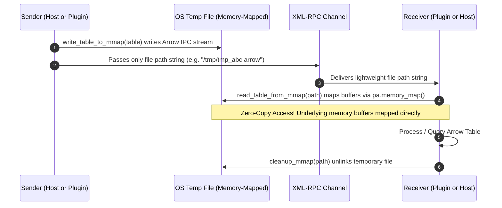

# Zero-Copy PyArrow IPC

Process isolation provides security and crash resilience, but sharing large data structures between separate OS processes is a classic performance bottleneck.

Behemoth solves high-throughput data transfer by combining lightweight XML-RPC control messages with **Zero-Copy PyArrow Inter-Process Communication (IPC)** using memory-mapped files.

---

## The Problem: The Overhead of Text Serialization

Behemoth uses XML-RPC as its default control plane protocol. While XML-RPC is robust and universal for passing function names, arguments, and simple primitives, it serializes data into plain XML strings.

Sending a 500MB or 1GB dataset (such as a large Pandas DataFrame, NumPy matrix, or financial tick stream) over XML-RPC creates severe bottlenecks:
1. **CPU Overhead**: Massive encoding and decoding overhead converting binary data to XML text.
2. **Memory Ballooning**: Data must be duplicated multiple times across string buffers, sockets, and Python heap allocations.
3. **Latency**: Inter-process transfer times jump from milliseconds to dozens of seconds.

---

## The Solution: PyArrow Memory-Mapped Files

Instead of serializing data buffers over the XML-RPC socket, Behemoth leverages Apache Arrow's columnar binary format and OS memory-mapping (`mmap`):



### Why Zero-Copy?
`pa.memory_map(path, 'r')` maps the file directly into the process address space without copying the underlying buffer into Python memory. The CPU can immediately read, filter, or slice columnar arrays at bus speeds (gigabytes per second).

---

## The Core IPC Module (`arrow_ipc.py`)

The memory-mapped IPC mechanism is implemented in three simple, robust functions:

```python
import pyarrow as pa
import pyarrow.ipc
import tempfile
import os
from pathlib import Path

def write_table_to_mmap(table: pa.Table) -> str:
    """
    Writes a PyArrow table to a temporary file via Arrow IPC RecordBatchFileWriter.
    Returns the absolute file path as a string.
    """
    fd, path = tempfile.mkstemp(suffix=".arrow")
    os.close(fd)
    
    with pa.OSFile(path, 'wb') as sink:
        with pa.RecordBatchFileWriter(sink, table.schema) as writer:
            writer.write_table(table)
            
    return path


def read_table_from_mmap(path: str) -> pa.Table:
    """
    Reads a PyArrow table from a memory-mapped file with zero memory copies.
    """
    # pa.memory_map ensures we don't copy the buffer into Python heap
    source = pa.memory_map(path, 'r')
    reader = pa.RecordBatchFileReader(source)
    return reader.read_all()


def cleanup_mmap(path: str) -> None:
    """
    Deletes the temporary IPC file.
    """
    try:
        os.remove(path)
    except OSError:
        pass
```

---

## Architectural Design: Injected, Not Hardcoded

:::important Modular Architecture
The `arrow_ipc` module is **NOT hardcoded into Behemoth core**. Instead, it lives in the host application's `host_api/` directory and is injected into plugins using `PluginClient(injected_packages=[...])`.

This design gives developers full freedom:
- You can use PyArrow IPC for tabular data.
- You can substitute SQLite, DuckDB, NumPy `.npy` memory maps, or POSIX shared memory (`multiprocessing.shared_memory`).
- Behemoth remains a lightweight, un-opinionated process manager.
:::

---

## Bidirectional Transfer Examples

### 1. Plugin → Host (Plugin generates data for Host)

In this scenario, a plugin performs data aggregation or fetches records and returns the result to the host:

#### Plugin Implementation (`plugins/query_plugin/__init__.py`)
```python
import pyarrow as pa
from host_api.arrow_ipc import write_table_to_mmap

def fetch_sensor_data(device_id: str) -> str:
    print(f"[Plugin] Fetching sensor data for {device_id}...")
    
    # Generate large dataset
    timestamps = range(1_000_000)
    temperatures = [20.0 + (i % 15) * 0.5 for i in range(1_000_000)]
    
    table = pa.Table.from_arrays(
        [pa.array(timestamps), pa.array(temperatures)],
        names=["timestamp", "temperature"]
    )
    
    # Write to mmap and return string path
    path = write_table_to_mmap(table)
    return path
```

#### Host Invocation (`host.py`)
```python
from host_api.arrow_ipc import read_table_from_mmap, cleanup_mmap

# 1. Invoke plugin action
mmap_path = client.run_action("query_plugin", "fetch_sensor_data", {"device_id": "sensor_01"})

# 2. Memory-map table with zero copy
table = read_table_from_mmap(mmap_path)
print(f"[Host] Loaded {table.num_rows:,} rows across {table.num_columns} columns.")

# 3. Perform analysis (or convert to pandas / polars / duckdb)
df = table.to_pandas()
print(df.head())

# 4. Clean up temporary file
cleanup_mmap(mmap_path)
```

---

### 2. Host → Plugin (Host passes data to Plugin)

In this scenario, the host provides a large dataset to a plugin for processing or visualization:

#### Plugin Implementation (`plugins/filter_plugin/__init__.py`)
```python
import pyarrow as pa
import pyarrow.compute as pc
from host_api.arrow_ipc import read_table_from_mmap, cleanup_mmap

def filter_outliers(mmap_path: str, max_temp: float = 25.0) -> dict:
    print(f"[Plugin] Reading input table from: {mmap_path}")
    table = read_table_from_mmap(mmap_path)
    
    # Filter in Arrow
    mask = pc.less_equal(table["temperature"], max_temp)
    filtered_table = table.filter(mask)
    
    result_count = filtered_table.num_rows
    
    # Always clean up when done reading
    cleanup_mmap(mmap_path)
    
    return {
        "original_rows": table.num_rows,
        "filtered_rows": result_count
    }
```

#### Host Invocation (`host.py`)
```python
import pyarrow as pa
from host_api.arrow_ipc import write_table_to_mmap

# 1. Create table on Host
table = pa.Table.from_pydict({
    "timestamp": [1, 2, 3, 4, 5],
    "temperature": [21.5, 26.0, 19.8, 28.2, 22.1]
})

# 2. Write to memory map
mmap_path = write_table_to_mmap(table)

# 3. Pass path over XML-RPC to plugin
result = client.run_action("filter_plugin", "filter_outliers", {
    "mmap_path": mmap_path,
    "max_temp": 25.0
})
print("[Host] Filter Result:", result)
```

---

## Performance Comparison

| Metric | Standard XML-RPC (100MB Array) | PyArrow Memory-Mapped IPC |
| :--- | :--- | :--- |
| **Transfer Latency** | ~4,200 ms (Serialization + Socket + Parse) | **~1.2 ms** (File write + RPC path string) |
| **Memory Footprint** | 3x to 4x dataset size (XML strings) | **1x** (Shared OS memory mapping) |
| **Throughput** | ~25 MB/s | **> 4,000 MB/s** (Disk/RAM buffer bound) |
| **Data Types Supported** | JSON/XML primitives only | High-dimensional Tensors, Tables, Structs, Dicts |

---

## Best Practices

- **Always Call `cleanup_mmap`**: The receiver (or sender upon error) should remove the temporary file once processing completes to prevent disk clutter.
- **Use `RecordBatchFileWriter`**: Always write using `RecordBatchFileWriter` (not `RecordBatchStreamWriter`) when memory mapping, as random access and file readers require the Arrow IPC file format footer.
- **Exception Safety**: Wrap `read_table_from_mmap` and processing logic in `try...finally` blocks ensuring `cleanup_mmap` is executed even if data processing raises an error.
