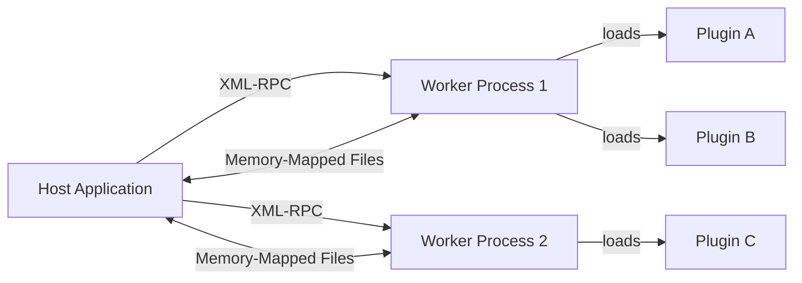

# Introduction to Behemoth

**Behemoth** is a high-performance, process-isolated plugin host framework for Python. It empowers developers to build modular, extensible host applications where third-party plugins execute inside completely isolated worker subprocesses, communicating seamlessly over XML-RPC with zero-copy PyArrow IPC for high-throughput data transfer. A critical failure, memory leak, or segfault inside an untrusted plugin never compromises the stability of the host application.

---

## High-Level Architecture

Behemoth delegates plugin execution to dedicated worker subprocesses while managing IPC channels and shared memory regions transparently.



---

## Key Features

- **Process Isolation**: Plugins run in dedicated worker subprocesses. An unhandled exception, infinite loop, or native C-extension segfault within a plugin leaves the host process completely unharmed.
- **Custom API Injection**: Host applications inject custom Python modules and domain-specific APIs into plugin workers via `sys.path` manipulation, similar to Grafana's modern plugin architecture.
- **Zero-Copy PyArrow IPC**: Transfer massive datasets (tables, tensors, audio/video buffers) between host and plugins using memory-mapped Arrow files. Only tiny file path strings cross the XML-RPC control channel, eliminating serialization bottlenecks.
- **Self-Healing Dependencies**: Automatic `.venv` creation, offline wheel building, and air-gapped deployment support per plugin. Drop a `requirements.txt` or a `wheels/` directory into a plugin, and Behemoth manages resolution automatically.
- **Deep Introspection**: Plugin functions are inspected at load time using `inspect.signature`, extracting parameter names, type annotations, defaults, and required flags to generate dynamic schemas.
- **Declarative Strategy Matching**: Tag plugin functions with UI metadata (such as lifecycle hooks, toolbar buttons, or context menu items) using flexible, configurable strategy patterns.
- **PyInstaller Native**: First-class PyInstaller support with custom hooks, bundled standalone Python interpreters (via `python-build-standalone`), and frozen binary worker interception.

---

## Quick Install

Get started with Behemoth in your current Python environment:

```bash
pip install .
```

> **Note**: If you are installing from source or developing plugins locally, see the full [Installation Guide](./getting-started/installation.md) to configure build dependencies and development tools.

---

## Next Steps

Ready to build your first isolated plugin? Check out the following resources:

- [Installation Guide](./getting-started/installation.md) — Prerequisites, developer tools, and the `dev.py` CLI workflow.
- [Quick Start Tutorial](./getting-started/quick-start.md) — Build and execute a minimal isolated plugin in under 5 minutes.
