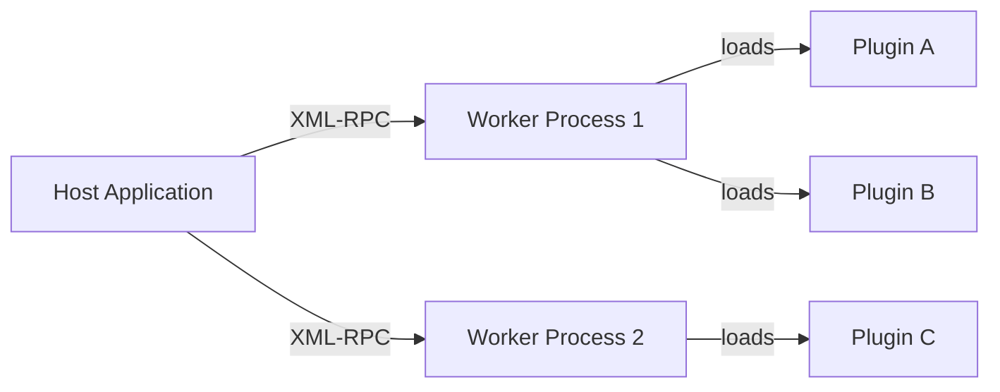

# Introduction to Evoker

**Evoker** is a high-performance, process-isolated plugin host framework for Python. It empowers developers to build modular, extensible host applications where third-party plugins execute inside completely isolated worker subprocesses, communicating seamlessly over XML-RPC. A critical failure, memory leak, or segfault inside an untrusted plugin never compromises the stability of the host application.

---

## High-Level Architecture

Evoker delegates plugin execution to dedicated worker subprocesses while managing IPC communication transparently.



### Core Philosophy

Evoker occupies a highly strategic, underserved niche: **Extending native applications with Python's data/AI ecosystem without compromising application stability.**

To achieve this, the framework is driven by three strict architectural principles:
1. **Stateless Invocation**: Evoker is built around a host-driven, request-response model. By enforcing this paradigm, Evoker forces plugin developers to write clean, modular extensions (microservices) rather than deeply entangled, state-corrupting scripts.
2. **No Synchronized State**: Many modern microservice and plugin architectures collapse under their own weight because they attempt to synchronize complex state and maintain chatty, two-way communication across boundaries. Evoker avoids this by explicitly restricting communication to simple invocations.
3. **True Process Isolation**: If a plugin crashes, segfaults, or OOMs, the host application must survive. Plugins are treated as untrusted worker nodes.

### Native Language Bindings

Evoker isn't just for Python host applications! We provide official, fully-featured host clients in **Python**, **Rust**, **C++**, and **C**. 

These native bindings include **Transparent Runtime Bootstrapping**. This means your native C++ or Rust application does **not** require the end-user to have Python installed on their system. The Evoker client will automatically download, extract, and provision an isolated `python-build-standalone` runtime behind the scenes!

---

## Key Features

- **Process Isolation**: Plugins run in dedicated worker subprocesses. An unhandled exception, infinite loop, or native C-extension segfault within a plugin leaves the host process completely unharmed.
- **Custom API Injection**: Host applications inject custom Python modules and domain-specific APIs into plugin workers via `sys.path` manipulation, similar to Grafana's modern plugin architecture.
- **Self-Healing Dependencies**: Automatic `.venv` creation, offline wheel building, and air-gapped deployment support per plugin. Drop a `requirements.txt` or a `wheels/` directory into a plugin, and Evoker manages resolution automatically.
- **Deep Introspection**: Plugin functions are inspected at load time using `inspect.signature`, extracting parameter names, type annotations, defaults, and required flags to generate dynamic schemas.
- **Declarative Strategy Matching**: Tag plugin functions with UI metadata (such as lifecycle hooks, toolbar buttons, or context menu items) using flexible, configurable strategy patterns.
- **PyInstaller Native**: First-class PyInstaller support with custom hooks, bundled standalone Python interpreters (via `python-build-standalone`), and frozen binary worker interception.

---

## Quick Install

Get started with Evoker in your current Python environment:

```bash
pip install .
```

> **Note**: If you are installing from source or developing plugins locally, see the full [Installation Guide](./getting-started/installation.md) to configure build dependencies and development tools.

---

## Next Steps

Ready to build your first isolated plugin? Check out the following resources:

- [Installation Guide](./getting-started/installation.md) — Prerequisites, developer tools, and the `dev.py` CLI workflow.
- [Quick Start Tutorial](./getting-started/quick-start.md) — Build and execute a minimal isolated plugin in under 5 minutes.
