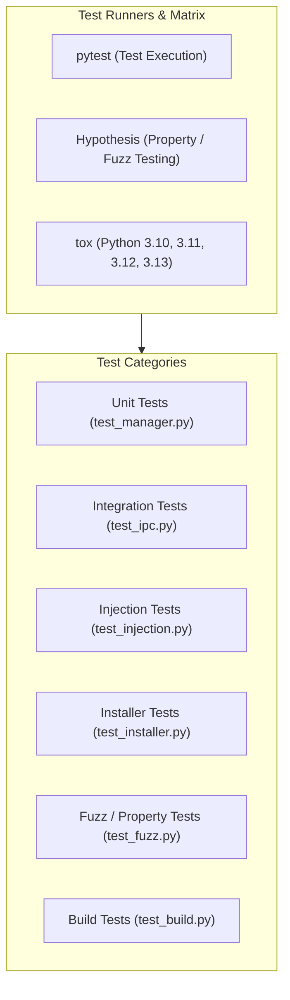

# Testing

Evoker features an extensive test suite covering unit validation, out-of-process IPC integration, dynamic package injection, dependency installation, property-based fuzzing, and compiled binary builds.

---

## Test Suite Architecture



---

## Test Infrastructure

### Frameworks & Libraries

- **[pytest](https://docs.pytest.org/)**: Primary test framework and test runner.
- **[Hypothesis](https://hypothesis.readthedocs.io/)**: Property-based testing engine used to generate edge-case inputs for parsers, serializers, and introspection engines.
- **[pytest-xprocess](https://pytest-xprocess.readthedocs.io/)**: Process management fixture for launching and managing background test processes.
- **[tox](https://tox.wiki/)**: Multi-environment orchestration running tests across Python versions **3.10**, **3.11**, **3.12**, and **3.13**.

### Configuration

#### `pytest.ini`

Configures the root source path and default test directory:

```ini
[pytest]
pythonpath = src
testpaths = tests
```

#### `tox.ini`

Automates testing across target Python runtimes with isolated test dependencies:

```ini
[tox]
envlist = py310, py311, py312, py313
isolated_build = True

[testenv]
deps =
    pytest
    hypothesis
    pytest-xprocess
commands =
    pytest tests/
```

### Shared Fixtures (`tests/conftest.py`)

- **`temp_plugins_dir(tmp_path)`**: Provides an isolated temporary filesystem path (`tmp_path / "plugins"`) for writing transient mock plugins during tests.
- **`manager()`**: Provides a fresh, default-configured instance of `PluginManager`.

```python
import pytest
from pathlib import Path
from plugin_host.manager import PluginManager

@pytest.fixture
def temp_plugins_dir(tmp_path):
    return tmp_path / "plugins"

@pytest.fixture
def manager():
    return PluginManager()
```

---

## Test Categories

### 1. Unit Tests (`tests/test_manager.py`)

Verifies core plugin discovery, manifest parsing, syntax validation, function introspection, and strategy matching in isolation.

- **Plugin Loading & Validation**:
  - Missing `manifest.json` triggers graceful skip and warning.
  - Malformed/corrupt JSON in `manifest.json` is safely ignored.
  - Missing `__init__.py` module entrypoint is safely skipped.
  - Python syntax errors within plugin files are caught and logged without aborting host execution.
- **Function Introspection**:
  - Validates parameter type inference from annotations (defaults to `str`).
  - Verifies parameter requirement flags (`required: True` vs `required: False`).
  - Ensures private functions (prefixed with `_`) are filtered out.
- **Strategy Matching**:
  - Verifies `ExactMatchStrategy` matches target names and signatures.
  - Verifies `ExactMatchStrategy` raises `ValueError` and discards actions on signature parameter mismatches.
  - Verifies `PrefixStrategy` accurately extracts prefix metadata (e.g. `menu_name`).

---

## 2. Integration Tests (`tests/test_ipc.py`)

Tests end-to-end communication between `PluginClient` and the out-of-process XML-RPC worker.

- **Lifecycle Roundtrip**: Boots worker subprocess, scrapes ephemeral port, establishes XML-RPC connection, executes `scan()`, and cleanly terminates worker.
- **Remote Invocation**: Calls plugin functions with keyword arguments over XML-RPC and verifies returned data.
- **Exception Propagation**: Verifies that exceptions raised inside plugin functions are marshalled as `xmlrpc.client.Fault` and received by the client.
- **Worker Resilience**: Confirms worker process remains alive and operational after catching plugin exceptions.

---

## 3. Injection Tests (`tests/test_injection.py`)

Tests host API and module injection into worker processes.

- **Custom API Injection**: Injects mock host API directories into `sys.path`, verifying that loaded plugins can import host APIs (`import host_api`) and execute host methods.
- **Multiple Injected Paths**: Passes multiple directories to `injected_packages` and verifies all paths resolve in order of priority.

---

## 4. Installer Tests (`tests/test_installer.py`)

Validates automated dependency installation and virtual environment management.

- **No Requirements**: Plugins without `requirements.txt` succeed immediately without creating unnecessary `.venv` folders.
- **Online Installation**: Installs lightweight PyPI packages into the plugin `.venv`.
- **Install Failure**: Ensures non-existent packages or invalid requirements raise `DependencyInstallError`.
- **Offline Wheels**: Verifies `--find-links` is passed to pip when local `.whl` archives exist in `wheels/`.
- **Fault-Tolerant Loading**: Confirms `PluginManager` gracefully skips plugins with failed dependencies rather than crashing.

---

## 5. Property & Fuzz Tests (`tests/test_fuzz.py`)

Uses `Hypothesis` to generate random, high-entropy inputs to test edge cases and boundary conditions.

- **Signature Introspection Fuzzing**: Fuzzes function introspection with arbitrary parameter names, default values, and annotations.
- **Manifest JSON Fuzzing**: Fuzzes manifest loader with arbitrary text and malformed JSON structures.
- **PrefixStrategy Fuzzing**: Tests `PrefixStrategy` with arbitrary string inputs and unicode characters.
- **Environment Parser Fuzzing**:
  - Tests `parse_injected_packages` against arbitrary strings and corrupt JSON.
  - Tests `parse_strategies` against random JSON payloads.
- **RPC Serialization Fuzzing**: Sends arbitrary nested dictionaries through the XML-RPC layer to ensure robust payload marshalling.

---

## 6. Build Tests (`tests/test_build.py`)

Verifies standalone binary packaging and distribution capabilities.

- **PyInstaller Compilation**: Executes a full PyInstaller build on Windows.
- **Binary Execution**: Runs the compiled host executable, verifying that the embedded hook (`--evoker-worker`) spawns worker subprocesses correctly.
- **Wheel & Plugin Verification**: Verifies automatic offline wheel building and plugin execution within the compiled standalone distribution.

---

## Running Tests

### Run the Full Test Suite

```bash
python -m pytest
```

### Run a Specific Test File

```bash
python -m pytest tests/test_fuzz.py -v
```

### Run Tests with Detailed Output and Tracebacks

```bash
python -m pytest -v --tb=short
```

### Run Across Multi-Python Environments with Tox

```bash
tox
```
